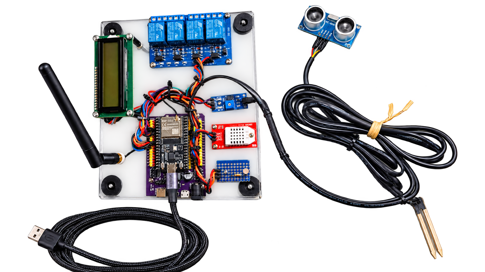
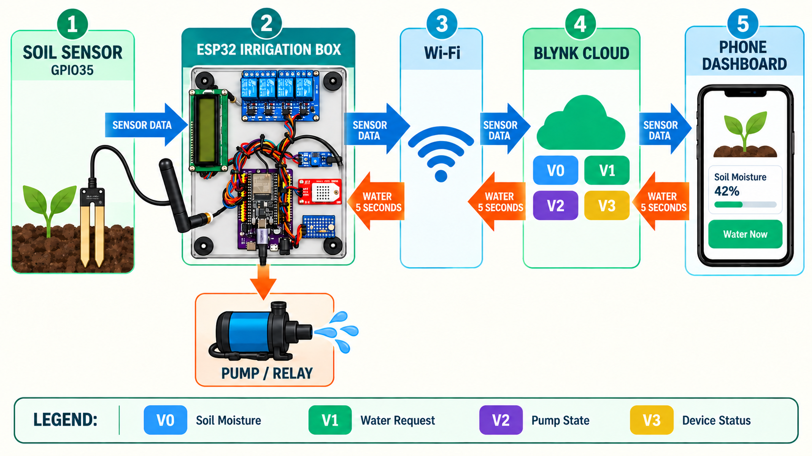
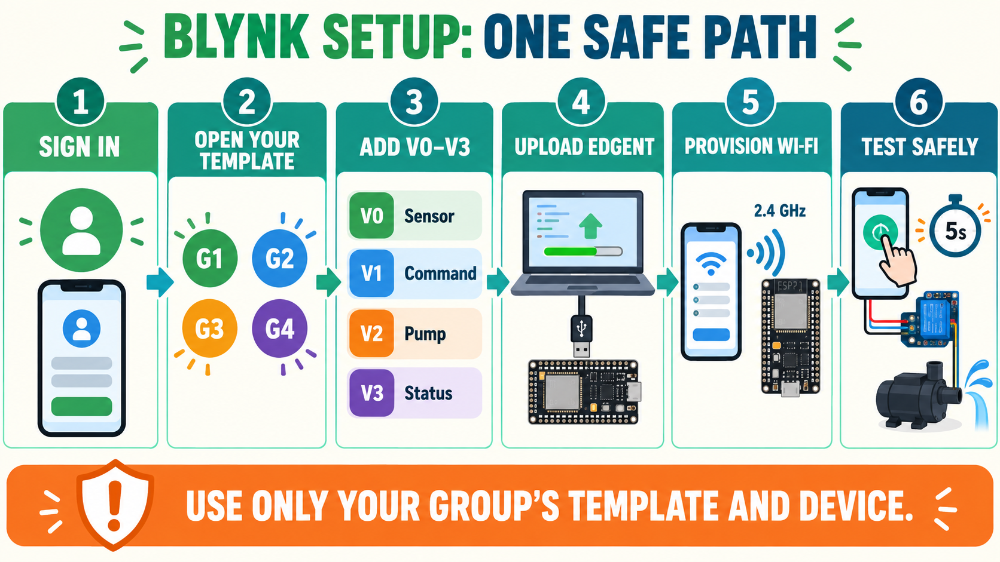
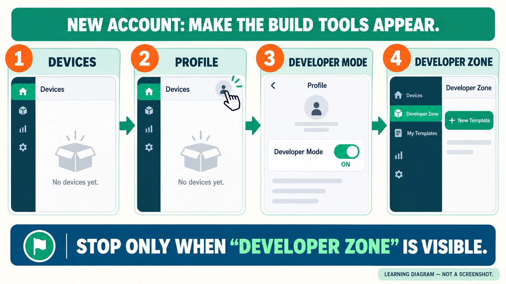
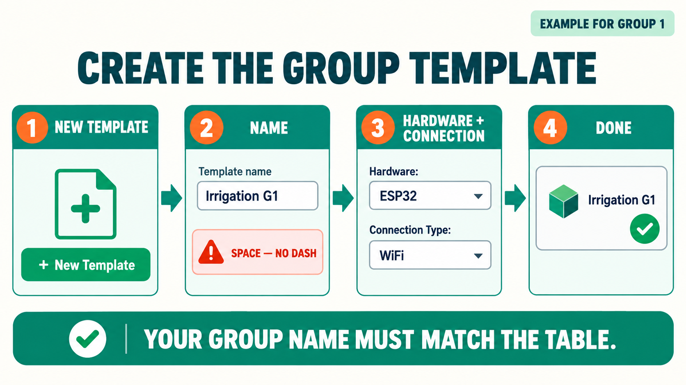
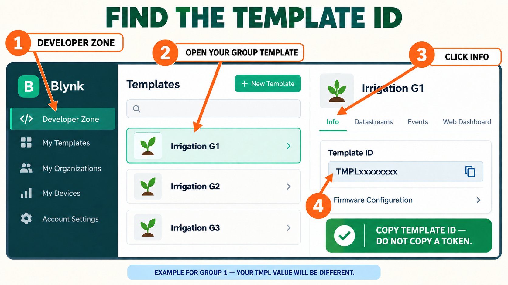
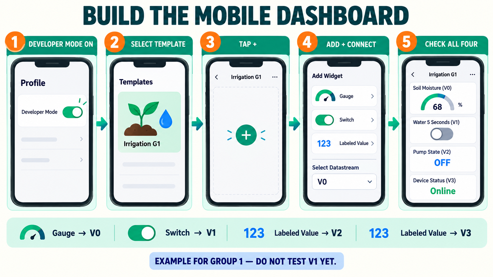
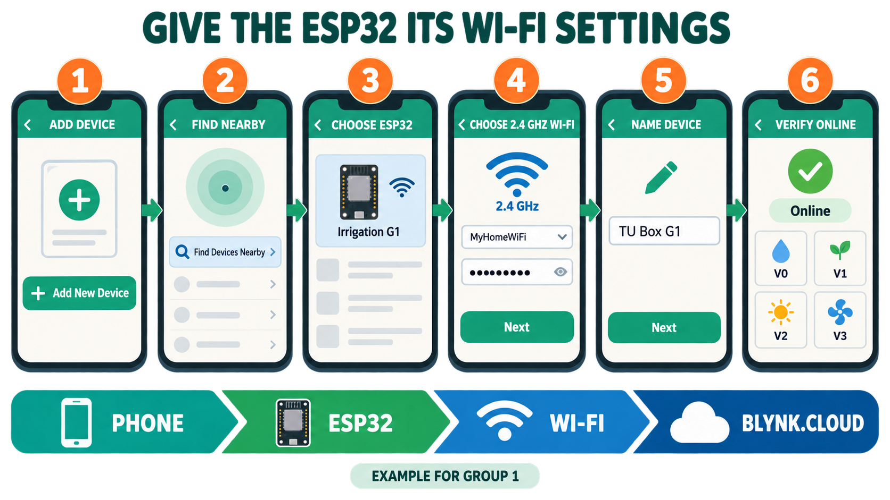

# Beginner ESP32 Irrigation Dashboard Tutorial

This tutorial connects the ESP32 irrigation controller to Blynk. It is written as a click-by-click class activity for learners who have not used Blynk before.

By the end, a learner can:

- work safely within the Blynk resources assigned to their group;
- create four Blynk data channels, called datastreams;
- build a mobile dashboard one control or display at a time;
- give the ESP32 its approved 2.4 GHz Wi-Fi settings;
- create the group's Blynk device from the mobile app;
- read soil moisture on a phone;
- request one five-second watering cycle; and
- explain why the phone requests an action but the ESP32 enforces the safety timer.

Return to the [standalone ESP32 irrigation tutorial](README.md) if the soil sensor and GPIO27 relay have not already passed the local tests.



This beginner stage uses the soil sensor on GPIO35 and irrigation relay 3 on GPIO27. The other modules may remain mounted, but this sketch does not control them.

## First, understand what you are building

### What “Internet of Things” means

The **Internet of Things (IoT)** is not one component. It is the complete system formed when a physical object can sense or control something, exchange data through a network, and present that data to a person or another service.

In this lesson:

- the **physical thing** is the irrigation box;
- the **sensor** is the soil-moisture probe;
- the **local computer** is the ESP32;
- the **network** is the classroom 2.4 GHz Wi-Fi;
- the **cloud service** is Blynk.Cloud; and
- the **user interface** is the Blynk dashboard on the phone.

### What an edge device is

The word **edge** means “at the physical edge of the network, beside the real equipment.” The ESP32 irrigation box is the **edge device** because it reads the sensor and controls the relay beside the plant. “Edge” does not mean the Microsoft Edge browser.

The edge device must remain responsible for safety. The phone may request watering, but the ESP32 decides whether to operate GPIO27 and stops the relay locally after five seconds. A lost internet connection must never be the only way to stop a pump.

### What Blynk.Edgent is

**Blynk.Edgent** is software that runs on the ESP32. It helps a new device receive Wi-Fi settings, obtain its Blynk identity, connect to Blynk.Cloud, and later support device management. Edgent is not the ESP32 itself and it is not another cloud account.

The one-time process of giving a new device its network and cloud identity is called **provisioning**. During provisioning, the phone temporarily talks directly to the ESP32 and sends the approved Wi-Fi settings. The Wi-Fi password and Blynk Auth Token therefore do not need to be written in the Arduino sketch.



There are two journeys to understand:

| Journey | Path | Meaning |
| --- | --- | --- |
| Measurement | Soil probe → ESP32 → Wi-Fi → Blynk.Cloud → phone | The learner sees the current soil-moisture value |
| Command | Phone → Blynk.Cloud → Wi-Fi → ESP32 → relay | The learner requests watering; the ESP32 enforces the five-second limit |

### Vocabulary used throughout the tutorial

| Term | Plain-language meaning | This lesson's example |
| --- | --- | --- |
| IoT system | All connected hardware, software, network, and user-interface parts | The complete irrigation learning system |
| Edge device | The physical computer working beside the sensor and actuator | ESP32 irrigation box |
| Blynk.Cloud | The internet service carrying device data and commands | Connects the ESP32 and phone |
| Provisioning | First-time transfer of Wi-Fi and device identity | Performed with Blynk.Edgent in Part 8 |
| Template | A blueprint shared by devices: datastreams and dashboard layouts | `Irrigation G1` |
| Template ID | Blynk's generated identifier for one template | Begins with `TMPL`; copied in Part 5 |
| Device | One provisioned physical box represented in Blynk | `TU Box G1` |
| Datastream | A named cloud data channel | `Soil Moisture (V0)` |
| Virtual Pin | The software channel number used by a datastream | V0, V1, V2, or V3 |
| Widget | A visible dashboard control or display | Gauge, Switch, or Labeled Value |

A Virtual Pin is not an ESP32 GPIO. `V1` is a cloud communication channel; it does **not** mean GPIO1. This lesson physically reads GPIO35 and physically controls GPIO27.

One group's objects fit together in this order:

```text
Template: Irrigation G1
    ├── Template ID: TMPL... (generated by Blynk)
    ├── Datastreams: V0, V1, V2, V3
    └── Mobile dashboard layout
              │
              ▼ used by Blynk.Edgent during provisioning
Physical ESP32 box ───────────────► Device: TU Box G1
```

The template is the blueprint; the device is the provisioned physical instance. Do not use the two words as if they mean the same thing.

### The four data channels

| Name | Virtual Pin | Direction | Purpose |
| --- | --- | --- | --- |
| Soil Moisture | V0 | ESP32 to dashboard | Moisture from 0 to 100 percent |
| Water 5 Seconds | V1 | Dashboard to ESP32 | A value of 1 requests one short watering cycle |
| Pump State | V2 | ESP32 to dashboard | Shows 0 for off or 1 for on |
| Device Status | V3 | ESP32 to dashboard | Shows `READY` or `WATERING` |

See Blynk's [Virtual Pins documentation](https://docs.blynk.io/en/blynk-library-firmware-api/virtual-pins) and [device-control guide](https://docs.blynk.io/en/getting-started/using-virtual-pins-to-control-physical-devices) for the platform concepts behind these channels.

## The complete learning path



Follow the stages in order. Each part ends with a **checkpoint**: an observable result that proves the learner is ready to continue. If the checkpoint is not true, stay in that part and use its help section.

### If you get lost, identify the screen you can see

| What is visible now | What it means | Continue at |
| --- | --- | --- |
| Empty **Devices** page | Signed in, but build tools are not visible yet | Part 2 |
| **Developer Zone** and **+ New Template** | Developer Mode is on | Part 3 |
| Template name with **Info** and **Datastreams** tabs | A template workspace is open | Part 4 or Part 5 |
| Phone canvas with a **+** button | Mobile template editor is open | Part 6 |
| Arduino Serial Monitor waiting for configuration | Edgent firmware is uploaded | Part 8 |
| A named device tile showing **Online** | Provisioning is complete | Part 9 |

Do not keep clicking when the visible screen belongs to a later part. Return to the last completed checkpoint first.

## Shared training account and group names

Use the newly created classroom Blynk account:

```text
Email: itetu.training@gmail.com
```

The account starts with no class templates and no class devices. Part 3 creates the four group templates. Part 8 provisions the four physical boxes and creates their device records.

The instructor should enter the password privately. Learners must not write the password in this repository, a slide, a screenshot, or a group chat. Do not change the password, sign another station out, or change account settings.

| Group | Colour | Exact template name | Exact device name |
| --- | --- | --- | --- |
| 1 | Red | `Irrigation G1` | `TU Box G1` |
| 2 | Blue | `Irrigation G2` | `TU Box G2` |
| 3 | Green | `Irrigation G3` | `TU Box G3` |
| 4 | Yellow | `Irrigation G4` | `TU Box G4` |

Each group creates or edits only its own template and provisions only its own box. **Do not type a dash or hyphen in a Blynk template name.** Use the single space before `G` exactly as shown.

Blynk's [template Info reference](https://docs.blynk.io/en/blynk.console/templates/info) specifies letters, digits, and spaces for template names.

Before clicking anything, complete this station record:

```text
Our group number: ____________________
Our template name: ___________________
Our device name: _____________________
```

Shared-account rules:

1. Work only inside the template and device named in the station record.
2. Never rename or delete another group's work.
3. Never operate another group's watering control.
4. Never provision an ESP32 from another group's template.
5. Ask the instructor before signing out or changing account settings.
6. If the displayed name does not match the station record, stop and return to the list.

### Suggested roles inside each group

| Role | Responsibility |
| --- | --- |
| Navigator | Reads the current step aloud and controls Blynk.Console or the app |
| Firmware builder | Edits and uploads the Arduino sketch |
| Recorder | Completes the station record, Template ID worksheet, and test table |
| Safety checker | Verifies group names, relay-off state, power, and the current checkpoint |

Rotate roles after Part 5 so that one learner does not perform every action.

## Safety before connecting Blynk

- Complete the local relay test before adding Wi-Fi.
- First test with the relay LED only. Leave the pump or valve disconnected from the relay screw terminals.
- The example expects an **active-low** relay on GPIO27: `HIGH` is off and `LOW` is on.
- Keep the ESP32, relay logic, and student wiring at safe low voltage.
- Use a separate fused supply for a pump or valve. Never power a load from an ESP32 pin or USB port.
- Keep mains-voltage wiring out of the student exercise. A qualified electrician must handle any mains load.
- The ESP32 stops a watering cycle after five seconds even if the phone disconnects.
- Provision only a trusted classroom 2.4 GHz Wi-Fi network. Do not use a personal hotspot unless the instructor approves it.
- Supervise the system. The five-second timer is a classroom safeguard, not a complete field safety system.
- Follow the voltage-domain rules in the [standalone hardware tutorial](README.md#important-safety-rules), especially if the shield voltage rail is set to 5 V.

## Before you begin

- ESP32 box with the soil sensor on GPIO35 and an active-low relay input on GPIO27
- USB data cable and Arduino IDE
- Blynk library for Arduino
- A 2.4 GHz Wi-Fi network the ESP32 may use; many ESP32 boards cannot join a 5 GHz-only network
- Wi-Fi network name and password available privately during provisioning
- Blynk mobile app on a phone or tablet
- Shared account already signed in, or the instructor present to sign it in
- Your completed group station record

Do not publish a Wi-Fi password, account password, or Blynk Auth Token. Blynk.Edgent sends the Wi-Fi credentials and a device token during provisioning, so they do not belong in the Arduino sketch. Use a temporary or isolated training network when possible.

## Part 1: Install the Blynk library

1. Open Arduino IDE.
2. Click **Tools > Manage Libraries**.
3. Click the search field and type `Blynk`.
4. Find the library published by Volodymyr Shymanskyy.
5. Select the latest stable version shown by Library Manager.
6. Click **Install**.
7. Wait until Arduino IDE reports that installation has finished.
8. Click **File > Examples > Blynk > Blynk.Edgent**.
9. Confirm that **Edgent_ESP32** appears.

**Checkpoint 1:** `Edgent_ESP32` is visible in the Examples menu. If it is missing, close and reopen Arduino IDE, then check Library Manager again.

Keep the ESP32 board package, board selection, and USB port settings from the standalone tutorial.

## Part 2: First sign-in and Developer Mode

A new Blynk account normally opens on an empty **Devices** page or starts a generic Quickstart walkthrough. That is expected. The class templates do not exist yet.



The image is a route map, not a literal screenshot. Button position can change; the bold labels below are the controls to find.

### A. Reach the empty Devices page

1. Open [Blynk.Console](https://blynk.cloud/) in a desktop browser.
2. Enter `itetu.training@gmail.com`.
3. Ask the instructor to enter the account password privately.
4. If Blynk starts a generic Quickstart walkthrough, leave it using the visible **X**, **Back**, or **Skip** control. Do not create a Quickstart device for this class.
5. Stop on the page headed **Devices**. Because this is a new account, **No devices yet** is the expected result.

If the walkthrough has no leave control, complete only the account/profile questions needed to reach **Devices**. Do not download Quickstart code, create a Quickstart device, or upload anything to the ESP32.

### B. Turn on the build tools

1. Find and click the **profile/person icon** at the top-right.
2. Find the switch labeled **Developer Mode** and turn it on.
3. Close the profile panel or return to the main page.
4. If the left navigation is collapsed, expand it with the three-line menu button.
5. Look for **Developer Zone** in the left navigation.
6. Click **Developer Zone**. On a new account, the template area should be empty and should offer **+ New Template**.

**Checkpoint 2:** the words **Developer Zone** and the button **+ New Template** are visible. Do not continue until both are visible.

If **Developer Zone** does not appear:

1. Confirm that the top-right account is `itetu.training@gmail.com`.
2. Open the profile menu again and confirm that **Developer Mode** still says **ON**.
3. Refresh the browser page once.
4. Expand the left navigation again.
5. If the switch cannot be enabled, stop and tell the instructor; do not continue by guessing another menu.

### C. Prepare the mobile app

The web console creates templates and datastreams. The mobile app builds the phone layout and later provisions the ESP32.

1. Open the **Blynk IoT** app.
2. Sign in to the same account, `itetu.training@gmail.com`.
3. Tap the **profile/person icon**.
4. Turn **Developer Mode** on.
5. Return to the main screen.
6. Do not look for a live device tile yet.

That empty device view is correct: Part 3 creates a template, while Part 8 creates the device.

## Part 3: Create the assigned group template

A **template** is the blueprint for a type of device. It will hold the four datastream definitions and both dashboard layouts. Creating a template does not create or connect an ESP32.



The image uses Group 1 as the example. Replace `G1` with the assigned group number.

### A. Check before creating

1. In Blynk.Console, click **Developer Zone**.
2. Look through the template tiles.
3. If the exact assigned name already exists, click that tile and go to **Checkpoint 3**. Do not create a copy.
4. If the exact assigned name does not exist, continue below.

### B. Create the template

1. Click **+ New Template**.
2. A template form or dialog opens.
3. Click the **Name** field.
4. Type the assigned template name exactly:

   - Group 1: `Irrigation G1`
   - Group 2: `Irrigation G2`
   - Group 3: `Irrigation G3`
   - Group 4: `Irrigation G4`

5. Confirm that the name has a space before `G` and contains no dash.
6. Open the **Hardware** dropdown and choose **ESP32**.
7. Open **Connection Type** or **Connectivity** and choose **WiFi**.
8. Click **Done** or **Create**.
9. Blynk should open the new template workspace. Look for the template name near the top and tabs such as **Info**, **Datastreams**, **Events**, and **Web Dashboard**.
10. Click **Save** at the top-right if it is visible.

### C. Protect other groups' work

- If `Irrigation G2` already exists and you are Group 1, leave it unchanged.
- If a duplicate such as `Irrigation G1 copy` was accidentally created, stop and ask the instructor to remove it. Learners should not delete shared-account resources themselves.
- Work in only one browser tab for the assigned template so that edits are not made to the wrong group.

**Checkpoint 3:** the exact group template name is visible at the top of an open template workspace, and its **Datastreams** tab is visible.

## Part 4: Add the four datastreams

A datastream tells Blynk what a value is called, what kind of value it carries, and which Virtual Pin the firmware uses. A widget cannot work until its datastream exists.

### A. Open the Datastreams editor

1. Confirm that the correct `Irrigation G1`, `Irrigation G2`, `Irrigation G3`, or `Irrigation G4` name is visible at the top.
2. Click the **Datastreams** tab.
3. If the page is read-only, click **Edit** at the top-right.
4. The list is empty in a new template. That is the correct starting point.

### B. Create V0 together

1. Click **+ New Datastream**.
2. Choose **Virtual Pin**. Do not choose a physical-pin datastream.
3. In **Name**, type `Soil Moisture`.
4. In **Pin**, choose `V0`.
5. In **Data Type**, choose **Integer**.
6. In **Minimum**, type `0`.
7. In **Maximum**, type `100`.
8. In **Unit**, type `%`.
9. Leave optional fields at their defaults unless the instructor says otherwise.
10. Click **Create**.
11. Confirm that a row named **Soil Moisture** now appears and shows V0.

### C. Create V1, V2, and V3

Repeat **+ New Datastream > Virtual Pin** for each row below. Read across one row at a time; do not reuse a pin.

| Datastream name | Pin | Data type | Minimum | Maximum | Unit |
| --- | ---: | --- | ---: | ---: | --- |
| Water 5 Seconds | V1 | Integer | 0 | 1 | leave blank |
| Pump State | V2 | Integer | 0 | 1 | leave blank |
| Device Status | V3 | String | not shown | not shown | leave blank |

1. When all four rows are visible, click **Save** or **Save and Apply** at the top-right.
2. Wait until the save finishes before leaving the page.

**Checkpoint 4:** compare the saved list with this compact map:

```text
V0  Soil Moisture     Integer  0–100  %
V1  Water 5 Seconds   Integer  0–1
V2  Pump State        Integer  0–1
V3  Device Status     String
```

There must be exactly four rows and each of V0, V1, V2, and V3 must appear once. If a pin is duplicated, edit or recreate the incorrect row before continuing. Blynk's official [datastream setup guide](https://docs.blynk.io/en/getting-started/template-quick-setup/set-up-datastreams) explains the same platform feature.

## Part 5: Find and record the Template ID

### Why this part exists

The ESP32 firmware must tell Blynk which blueprint it belongs to. It needs two values:

1. **Template Name** — the readable group name that the class chose.
2. **Template ID** — the unique value that Blynk generated when the template was created.

The Template ID is not a password. It normally begins with `TMPL`, and every group's value will be different. The Auth Token is a different value; Edgent obtains that later during provisioning.



The image is a screen map, not a literal screenshot. Use the labels **Developer Zone**, the group template name, **Info**, and **Template ID** as landmarks.

### A. Start from the template, not Devices

At the end of Part 4, the correct group template should still be open.

- If the template is open, continue to section B.
- If a list of templates is open, click the exact group tile.
- If the **Devices** page is open, click **Developer Zone**, then click the exact group tile.

Do not click **Add Device**, **Search**, or **My Devices** in this part. A new account has no class device yet; Part 8 creates it.

### B. Copy the ID

1. Read the template name at the top and compare it with the station record.
2. Click the tab labeled **Info**.
3. Find the card or field labeled **Template ID**.
4. Confirm that its value begins with `TMPL`.
5. Click the **copy icon** beside the value, or carefully select and copy the complete value.
6. Paste it into the group worksheet below. A Template ID is safe to record, but do not alter any character.
7. Find **Firmware Configuration** on the same page. Expand it if it is collapsed.
8. Confirm that its `BLYNK_TEMPLATE_NAME` line contains the exact group name with a space and no dash.

```text
Group number: ______________________________
Template name: _____________________________
Template ID beginning with TMPL: __________
```

Use the matching template-name line:

| Group | Exact line used by the firmware |
| --- | --- |
| 1 | `#define BLYNK_TEMPLATE_NAME "Irrigation G1"` |
| 2 | `#define BLYNK_TEMPLATE_NAME "Irrigation G2"` |
| 3 | `#define BLYNK_TEMPLATE_NAME "Irrigation G3"` |
| 4 | `#define BLYNK_TEMPLATE_NAME "Irrigation G4"` |

### C. If the Info tab is not visible

1. Confirm that **Developer Mode** is still on.
2. Confirm that a template workspace—not the Devices page—is open.
3. Save any unfinished datastream changes.
4. Click **Developer Zone** to return to the template list.
5. Reopen the exact group template.
6. Look across the template tabs for **Info**; widen the browser window if the tab row is clipped.
7. If **Info** is still absent, stop and show the instructor the complete browser window. Do not invent a Template ID or copy an Auth Token from another screen.

**Checkpoint 5:** the group worksheet contains one exact Template Name and one Template ID beginning with `TMPL`. It contains no Wi-Fi password and no Auth Token.

Blynk.Edgent will use these two template values in Part 7, then obtain the device Auth Token automatically in Part 8. See Blynk's official [Wi-Fi provisioning guide](https://docs.blynk.io/en/getting-started/activating-devices/blynk-edgent-wifi-provisioning).

## Part 6: Build the mobile dashboard

The dashboard is the learner's view of the IoT system. A **Gauge** displays data, a **Switch** sends a request, and **Labeled Value** widgets display device state.

The mobile dashboard and web dashboard are separate layouts stored in the template. Completing one does not automatically build the other. Build the mobile layout first. At this stage the layout can be designed, but it cannot show live values because the ESP32 device has not been provisioned yet.



The image is a learning illustration, not a literal screenshot. If an icon has moved, follow the written label and click path below.

### Open the correct mobile template

1. Open **Blynk IoT** and confirm that the shared account is signed in.
2. Tap the **profile/person icon**.
3. Turn **Developer Mode** on.
4. Return to the main screen.
5. Tap **Developer Mode** or the **wrench/tool icon**.
6. Find your exact template name.
7. Tap the exact template for your group: `Irrigation G1`, `Irrigation G2`, `Irrigation G3`, or `Irrigation G4`.
8. Confirm the template name at the top before adding a widget.

If the template is missing, pull to refresh once, confirm that the phone uses the same shared account, and confirm that Developer Mode is on. Do not create a second template from the phone.

### Add the Soil Moisture gauge

1. Tap **+** at the top-right. If there is no plus button, tap an empty area of the canvas.
2. In the widget list, tap **Gauge**.
3. Tap the new gauge to open its settings.
4. Tap **Datastream**.
5. Tap **Soil Moisture (V0)**.
6. Set the widget title to `Soil Moisture` if a title field is shown.
7. Confirm that the displayed range is 0 to 100 and the unit is `%`.
8. Tap **Back**, **Done**, or the **X** to return to the canvas; the exact close control depends on the phone.

### Add the Water 5 Seconds control

1. Tap **+**.
2. Tap **Switch**. If the app provides a Button widget with a **Push** mode, that is also acceptable.
3. Tap the new control to open its settings.
4. Tap **Datastream**.
5. Tap **Water 5 Seconds (V1)**.
6. Set the title to `Water 5 Seconds`.
7. Confirm that off is 0 and on is 1.
8. If a **Mode** setting appears, choose **Push**. If it does not, keep Switch mode; the ESP32 resets V1 to 0 after accepting a request.
9. Return to the canvas.

Do not test this control yet. The ESP32 code and no-load safety test must be ready first.

### Add the Pump State value

1. Tap **+**.
2. Tap **Labeled Value**.
3. Tap the new widget.
4. Tap **Datastream**.
5. Tap **Pump State (V2)**.
6. Set the title to `Pump State`.
7. Return to the canvas.

### Add the Device Status value

1. Tap **+**.
2. Tap **Labeled Value**.
3. Tap the new widget.
4. Tap **Datastream**.
5. Tap **Device Status (V3)**.
6. Set the title to `Device Status`.
7. Return to the canvas.

### Arrange and verify the layout

1. Long-press a widget and drag it to move it.
2. Select a widget and drag its green handles to resize it if handles appear.
3. Place the gauge at the top, the watering control below it, and the two status values at the bottom.
4. Open each widget once more and read its selected datastream aloud.
5. Leave Developer Mode.
6. Do not look for the live device yet. Blynk.Edgent creates it during Wi-Fi provisioning in Part 8.

**Checkpoint 6:** open each widget's settings and verify this one-to-one map before leaving the editor:

| Widget | Must use datastream |
| --- | --- |
| Soil Moisture gauge | `Soil Moisture (V0)` |
| Water 5 Seconds control | `Water 5 Seconds (V1)` |
| Pump State value | `Pump State (V2)` |
| Device Status value | `Device Status (V3)` |

Expected live layout:

```text
+---------------------------+
|     Soil Moisture  52%    |
|          (gauge)          |
+---------------------------+
|    [ WATER 5 SECONDS ]    |
+---------------------------+
| Pump: 0     Status: READY |
+---------------------------+
```

## Optional: build the web dashboard too

Do this only after the mobile layout works.

1. In Blynk.Console, click **Developer Zone**; its template list opens.
2. Open the exact template for your group: `Irrigation G1`, `Irrigation G2`, `Irrigation G3`, or `Irrigation G4`.
3. Click the **Web Dashboard** tab.
4. Click **Edit** at the top-right.
5. Drag a **Gauge** from the Widget Box to the dashboard.
6. Click its **gear/settings icon**, select `Soil Moisture (V0)`, and save the widget settings.
7. Add a **Switch** connected to `Water 5 Seconds (V1)`.
8. Add value/label widgets for `Pump State (V2)` and `Device Status (V3)`.
9. Click **Save**.
10. After Part 8 creates the device, click **Devices** in the left navigation, open the matching `TU Box G1`, `TU Box G2`, `TU Box G3`, or `TU Box G4` tile, and open its **Dashboard** tab.

## Part 7: Build and upload the Blynk.Edgent sketch

Blynk.Edgent uses several supporting tabs. Do not start with an empty one-file sketch.

The main `.ino` tab contains the irrigation logic. The supporting Edgent tabs contain the reusable Wi-Fi provisioning and cloud-connection logic. Both are required.

1. Open Arduino IDE.
2. Click **File > Examples > Blynk > Blynk.Edgent > Edgent_ESP32**.
3. Click **File > Save As** and save a working copy named `Irrigation_Edgent_G1`, `Irrigation_Edgent_G2`, `Irrigation_Edgent_G3`, or `Irrigation_Edgent_G4`.
4. Confirm that the Arduino editor shows the main `.ino` tab plus supporting tabs such as `BlynkEdgent.h` and `Settings.h`.
5. Open the main `.ino` tab. Replace its contents with the code below. Do not delete or rename the supporting tabs.
6. Change `CLASS_GROUP` to the station's group number.
7. Replace `YOUR_TEMPLATE_ID` with the Template ID copied from that group's template.
8. Leave `BLYNK_TEMPLATE_NAME` exactly as selected by the group block. Do not add a dash.

```cpp
#define BLYNK_PRINT Serial
#define APP_DEBUG
#define USE_ESP32_DEV_MODULE
#define BLYNK_FIRMWARE_VERSION "0.1.0"

#define CLASS_GROUP 1  // Change to 1, 2, 3, or 4 for this station

#define BLYNK_TEMPLATE_ID   "YOUR_TEMPLATE_ID"

#if CLASS_GROUP == 1
  #define BLYNK_TEMPLATE_NAME "Irrigation G1"
#elif CLASS_GROUP == 2
  #define BLYNK_TEMPLATE_NAME "Irrigation G2"
#elif CLASS_GROUP == 3
  #define BLYNK_TEMPLATE_NAME "Irrigation G3"
#elif CLASS_GROUP == 4
  #define BLYNK_TEMPLATE_NAME "Irrigation G4"
#else
  #error "CLASS_GROUP must be 1, 2, 3, or 4"
#endif

#include "BlynkEdgent.h"

const int soilPin = 35;
const int irrigationRelay = 27;

// Change these after measuring the sensor in dry and wet soil.
const int soilRawDry = 4095;
const int soilRawWet = 2000;

const unsigned long wateringTimeMs = 5000;

BlynkTimer timer;
bool watering = false;
unsigned long wateringStartedAt = 0;

void stopWatering() {
  digitalWrite(irrigationRelay, HIGH);  // Active-low relay: HIGH is off
  watering = false;
  if (Blynk.connected()) {
    Blynk.virtualWrite(V2, 0);
    Blynk.virtualWrite(V3, "READY");
  }
}

void startWatering() {
  if (watering) {
    return;
  }

  digitalWrite(irrigationRelay, LOW);   // Active-low relay: LOW is on
  watering = true;
  wateringStartedAt = millis();
  Blynk.virtualWrite(V2, 1);
  Blynk.virtualWrite(V3, "WATERING");
}

// Blynk calls this function whenever the phone changes V1.
BLYNK_WRITE(V1) {
  int request = param.asInt();

  if (request == 1) {
    startWatering();
    Blynk.virtualWrite(V1, 0);  // Return the phone control to its off state
  }
}

// Update the phone at a controlled rate instead of on every loop.
void sendSensorData() {
  int soilRaw = analogRead(soilPin);
  int soilPercent = map(soilRaw, soilRawDry, soilRawWet, 0, 100);
  soilPercent = constrain(soilPercent, 0, 100);

  if (Blynk.connected()) {
    Blynk.virtualWrite(V0, soilPercent);
  }

  Serial.print("Soil raw: ");
  Serial.print(soilRaw);
  Serial.print("  Moisture: ");
  Serial.print(soilPercent);
  Serial.println("%");
}

BLYNK_CONNECTED() {
  Blynk.virtualWrite(V1, 0);
  Blynk.virtualWrite(V2, watering ? 1 : 0);
  Blynk.virtualWrite(V3, watering ? "WATERING" : "READY");
}

void setup() {
  Serial.begin(115200);
  delay(100);

  pinMode(soilPin, INPUT);
  pinMode(irrigationRelay, OUTPUT);
  digitalWrite(irrigationRelay, HIGH);  // Keep pump off during startup

  BlynkEdgent.begin();
  timer.setInterval(2000L, sendSensorData);
}

void loop() {
  BlynkEdgent.run();
  timer.run();

  // This local timer still stops the relay if the phone loses connection.
  if (watering && millis() - wateringStartedAt >= wateringTimeMs) {
    stopWatering();
  }
}
```

The sketch uses `BlynkTimer` to send sensor data once every two seconds. Do not put an unrestricted `Blynk.virtualWrite()` in `loop()`: Blynk warns that sending on every loop can flood the cloud connection. See [Send Data From Hardware to Blynk](https://docs.blynk.io/en/getting-started/how-to-display-any-sensor-data-in-blynk-app).

`BlynkEdgent.begin()` starts dynamic provisioning and `BlynkEdgent.run()` maintains provisioning, Wi-Fi, cloud connectivity, and the application connection. Do not add `BLYNK_AUTH_TOKEN`, `wifiName`, `wifiPassword`, or `Blynk.begin(...)` to this Edgent sketch.

### Read the program as five small jobs

| Code area | Job |
| --- | --- |
| `CLASS_GROUP`, Template ID, Template Name | Identifies which group blueprint this firmware belongs to |
| `soilPin`, `irrigationRelay` | Connects the software to GPIO35 and GPIO27 |
| `sendSensorData()` | Reads the probe and publishes V0 every two seconds |
| `BLYNK_WRITE(V1)` | Receives one watering request from the dashboard |
| Local `millis()` timer | Stops watering after five seconds even if the phone disconnects |

`Blynk.virtualWrite(V0, ...)` sends information to the dashboard. `BLYNK_WRITE(V1)` receives information from the dashboard. These two directions are different and should be explained aloud before uploading.

Before uploading:

1. Confirm that `YOUR_TEMPLATE_ID` has been replaced.
2. Confirm that `CLASS_GROUP` matches the group number printed on the irrigation box.
3. Confirm that **Tools > Board** is the correct ESP32 board and **Tools > Port** is the box's USB port.
4. Keep the pump or valve disconnected from the relay contacts.
5. Click **Upload**.
6. Open **Serial Monitor** at 115200 baud after the upload finishes.

The example defines the ESP32 BOOT button on GPIO0 as the Edgent reset button. It does not use GPIO27 or GPIO35. Do not change `Settings.h` during this beginner activity.

**Checkpoint 7:** Arduino IDE reports a successful upload, the relay remains off, and Serial Monitor shows the Edgent firmware waiting for configuration or entering setup mode. Do not continue if the relay energizes during startup.

## Part 8: Provision Wi-Fi and create the edge device

Provisioning creates the device and securely gives the ESP32 its network credentials and unique Auth Token. Keep Serial Monitor open so your group can see each state change.



The image shows Group 1 as an example. The temporary ESP32 setup network is not the classroom Wi-Fi: the phone connects to it briefly so it can deliver the classroom network details.

| Moment | Phone connection | ESP32 job |
| --- | --- | --- |
| Discovery | Phone searches nearby setup networks | ESP32 advertises a temporary Blynk setup network |
| Configuration | Phone talks directly to the ESP32 | ESP32 receives the selected Wi-Fi name and password |
| Cloud connection | Phone returns to normal networking | ESP32 joins 2.4 GHz Wi-Fi and authenticates with Blynk.Cloud |
| Normal operation | Phone uses Blynk.Cloud | ESP32 sends V0/V2/V3 and receives V1 |

### Prepare the phone and ESP32

1. Connect the phone to the classroom's **2.4 GHz Wi-Fi** network.
2. Confirm that the phone can reach the internet on that network.
3. Turn on the ESP32 and wait for its Edgent setup mode. Serial Monitor should indicate that it is waiting for configuration.
4. Open **Blynk IoT** and confirm that `itetu.training@gmail.com` is signed in.
5. Allow **Nearby devices**, **Local network**, or **Location** permission if the operating system requests it. Blynk needs the relevant permission to discover the ESP32 setup network.

### Add and connect the edge device

1. Open the app's **menu icon** at the top-right.
2. Tap **+ Add New Device** or **Add new device**.
3. Tap **Find Devices Nearby**.
4. Tap **Start** or **Ready**.
5. Wait for the device list. Select the setup device whose name begins with `Blynk` and contains your exact template name, such as `Irrigation G2`.
6. If iOS opens system Wi-Fi settings, select that Blynk setup network, return to the Blynk app, and tap **Already connected**.
7. On **Connect your device to WiFi**, tap **Choose Wi-Fi network**.
8. Select the approved classroom 2.4 GHz network. Do not choose a 5 GHz-only or browser-sign-in network.
9. Enter the Wi-Fi password privately.
10. Leave **Remember this network** off on a shared device unless the instructor specifically wants Blynk to retain it for the next group.
11. Tap **Continue**.
12. Keep the phone close to the ESP32 and wait. Do not close the app, unplug the ESP32, or switch networks while it shows connecting or configuring.
13. When Blynk reports that the device is connected, tap **Continue**.

### Name and verify the device

1. In **Device Name**, enter the exact space-separated name from the group table:

   - Group 1: `TU Box G1`
   - Group 2: `TU Box G2`
   - Group 3: `TU Box G3`
   - Group 4: `TU Box G4`

2. Do not type a dash or hyphen.
3. Review the device profile and confirm that its template and group number match.
4. Tap **Apply**.
5. Tap **Continue**.
6. Tap **Exit to app**.
7. Open **Devices** and tap the newly created `TU Box G1`, `TU Box G2`, `TU Box G3`, or `TU Box G4` tile.
8. Confirm that the device shows **Online** and that the four-widget mobile dashboard appears.

**Checkpoint 8:** all four statements are true:

- the device tile has the exact `TU Box G1`, `TU Box G2`, `TU Box G3`, or `TU Box G4` group name;
- the device shows **Online**;
- the correct four-widget dashboard opens; and
- Serial Monitor shows a successful network and cloud connection.

Under the hood, the ESP32 temporarily operates as a Wi-Fi access point. The phone sends the selected network credentials to it, Blynk supplies a unique Auth Token, the ESP32 stores the values in flash memory, and then it restarts and connects to Blynk.Cloud. The Wi-Fi password and token are not stored in this repository.

### If provisioning fails

- Read Serial Monitor before trying again. It normally reveals whether the ESP32 cannot join Wi-Fi or cannot reach Blynk.Cloud.
- Confirm that the Template ID and Template Name in the sketch exactly match the selected group template.
- Confirm that the Wi-Fi network is 2.4 GHz and does not require a browser login page.
- If an existing device record must keep its data, open that device in the app, open its action menu, and choose **Reconfigure**. Do not create a duplicate.
- With the instructor present, holding the ESP32 **BOOT** button for about 10 seconds while the Edgent firmware is running clears locally stored provisioning credentials and returns it to setup mode.
- Never delete another group's device while troubleshooting.

For the underlying sequence and current app screens, see Blynk's [Edgent Wi-Fi provisioning guide](https://docs.blynk.io/en/getting-started/activating-devices/blynk-edgent-wifi-provisioning) and [Add New Device guide](https://docs.blynk.io/en/blynk.apps/device-management/add-new-device).

## Part 9: Test without a pump

1. Confirm again that the pump or valve is disconnected from the relay contacts.
2. Open Serial Monitor at 115200 baud.
3. Wait for Blynk to report that the device is ready or online.
4. Check that the mobile dashboard shows a changing moisture value.
5. Tap **Water 5 Seconds** once.
6. Confirm that the GPIO27 relay indicator turns on, `Pump State` changes to 1, and `Device Status` shows `WATERING`.
7. Confirm that the relay turns off after about five seconds and the dashboard returns to `Pump State = 0` and `READY`.
8. Turn off the phone's Wi-Fi during a new test. Confirm that the relay still turns off after five seconds.
9. Repeat the test three times before connecting a real load.

Stop immediately if the relay turns on during ESP32 reset, remains on longer than five seconds, or behaves opposite to the comments in the code. The relay board may not match the expected active-low design.

**Checkpoint 9:** three consecutive no-load tests start only after one dashboard request and stop automatically after approximately five seconds.

## Part 10: Supervised water test

Only continue after the no-load test passes.

1. Disconnect all power.
2. Connect a low-voltage pump or valve to the relay's `COM` and `NO` terminals using its separate fused supply.
3. Check tubing, polarity, insulation, and the water path.
4. Restore power while a teacher or another responsible person watches the system.
5. Tap the watering control once.
6. Verify that water flows to the correct area and stops after five seconds.
7. Check for leaks and confirm that the ESP32 does not reset when the pump starts.

Do not repeatedly press the button to defeat the short-run limit. A later version should also include a tank-empty input, a longer lockout between runs, flow confirmation, and a physical emergency stop.

**Checkpoint 10:** the supervised low-voltage water test delivers water to the intended area, stops automatically, and causes no leak or ESP32 reset.

## Record your test results

Complete this table during the test.

| Observation | Expected result | Actual result |
| --- | --- | --- |
| ESP32 starts | Relay remains off | |
| Edgent setup begins | App discovers the correct group template | |
| Wi-Fi provisioning finishes | Correct group device is online | |
| Soil probe in dry sample | Moisture moves toward 0% | |
| Soil probe in moist sample | Moisture moves toward 100% | |
| Phone control pressed once | Relay turns on | |
| Five seconds pass | Relay turns off | |
| Phone loses connection during watering | Relay still turns off | |

Answer these questions:

1. What is the difference between GPIO27 and Virtual Pin V1?
2. Why does the program use a timer instead of leaving the phone switch in control of the relay?
3. What additional sensor should prevent a pump from running with an empty tank?
4. Why are the Wi-Fi password and Auth Token not written in the Edgent sketch?

## Troubleshooting

| Symptom | Check |
| --- | --- |
| Sketch does not compile | Update the Blynk library, open the `Edgent_ESP32` example, keep all supporting tabs, and confirm the ESP32 board package is selected |
| ESP32 does not appear in **Find Devices Nearby** | Check Serial Monitor for waiting/configuration mode, allow nearby/local-network permissions, and confirm Template ID and Template Name are exact |
| App cannot send Wi-Fi settings | Keep the phone near the ESP32; on iOS, connect to the Blynk setup network in Settings and return to the app |
| ESP32 cannot join the network | Choose a 2.4 GHz network, re-enter its password, and avoid captive-portal or browser-sign-in networks |
| Device stays offline after provisioning | Read Serial Monitor, verify internet access to Blynk.Cloud, and use **Reconfigure** rather than creating a duplicate |
| Edgent reports an authentication/configuration error | Remove any manually defined `BLYNK_AUTH_TOKEN`; confirm the group Template ID and space-separated Template Name, then reset and provision again |
| Duplicate device name appears | Stop and tell the instructor; do not delete or rename another group's device |
| Dashboard has no values | Confirm that widgets use V0, V1, V2, and V3 exactly as listed |
| Moisture is always 0% or 100% | Record the raw serial readings and replace `soilRawDry` and `soilRawWet` with measured values |
| Button changes but relay does not | Check the V1 datastream, GPIO27 wiring, common ground, and relay input-voltage compatibility |
| Relay logic is reversed | Stop the test and verify whether the relay module is active low or active high before changing code |
| ESP32 resets when pump starts | Disconnect the pump; correct load power, grounding, suppression, and wiring before retesting |
| Dashboard control stays on | Confirm V1 accepts device updates and that `Blynk.virtualWrite(V1, 0)` is present |

## Optional challenge: automatic mode

Do not add automatic watering until every group can explain and test the five-second manual cycle. A good next exercise is to add a `Manual/Automatic` datastream and start a short watering cycle only when all of these are true:

- automatic mode is enabled;
- soil moisture is below the calibrated threshold;
- the tank is not empty;
- the minimum time between watering cycles has passed; and
- no sensor-failure condition is active.

Keep the maximum runtime enforced locally on the ESP32. Cloud connectivity should provide monitoring and requests, but it should never be the only mechanism capable of stopping a pump.
