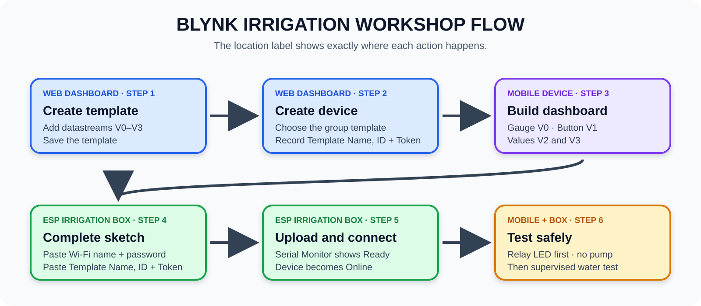

# Beginner ESP32 Irrigation Dashboard Tutorial

This tutorial connects the ESP32 irrigation controller to Blynk. It is written as a click-by-click class activity for learners who have not used Blynk before.

By the end, a learner can:

- work safely within the Blynk resources assigned to their group;
- create four Blynk data channels, called datastreams;
- build a mobile dashboard one control or display at a time;
- give the ESP32 its approved 2.4 GHz Wi-Fi settings;
- create the group's Blynk device from the web dashboard;
- read soil moisture on a phone;
- request one five-second watering cycle; and
- explain why the phone requests an action but the ESP32 enforces the safety timer.

Return to the [standalone ESP32 irrigation tutorial](README.md) if the soil sensor and GPIO27 relay have not already passed the local tests.


This beginner stage uses the soil sensor on GPIO35 and irrigation relay 3 on GPIO27. The other modules may remain mounted, but this sketch does not control them.

## First, understand what you are building

### What “Internet of Things” means

The **Internet of Things (IoT)** is not one component. It is the complete system formed when a physical object can sense or control something, exchange data through a network, and present that data to a person or another service.

In this lesson:

- the **physical thing** is the irrigation box;
- the **sensor** is the soil-moisture probe;
- the **local computer** is the ESP32;
- the **network** is the classroom 2.4 GHz Wi-Fi;
- the **cloud service** is Blynk.Cloud; and
- the **user interface** is the Blynk dashboard on the phone.

### What an edge device is

The word **edge** means “at the physical edge of the network, beside the real equipment.” The ESP32 irrigation box is the **edge device** because it reads the sensor and controls the relay beside the plant. “Edge” does not mean the Microsoft Edge browser.

The edge device must remain responsible for safety. The phone may request watering, but the ESP32 decides whether to operate GPIO27 and stops the relay locally after five seconds. A lost internet connection must never be the only way to stop a pump.

### Why this workshop uses manual activation

Blynk offers a larger system called **Blynk.Edgent** for provisioning Wi-Fi from a phone, resetting credentials, status indication, and over-the-air updates. Those features are useful for products, but they consume much more ESP32 flash and add several concepts that are not needed in this short demonstration.

This workshop uses Blynk's simpler **manual device activation** instead. Learners create one device on the web dashboard, copy its generated **Auth Token**, and place that token together with the classroom Wi-Fi name and password in a one-file Arduino sketch. Blynk documents this workflow for prototypes and devices that do not require end-user activation.

The workshop Wi-Fi credentials are intentionally visible in the sketch. Use a temporary classroom network whose password may be shared, and change that password after the event if the network will be reused. The shared Blynk account password is still private because learners do not need it inside the firmware.


There are two journeys to understand:

| Journey | Path | Meaning |
| --- | --- | --- |
| Measurement | Soil probe → ESP32 → Wi-Fi → Blynk.Cloud → phone | The learner sees the current soil-moisture value |
| Command | Phone → Blynk.Cloud → Wi-Fi → ESP32 → relay | The learner requests watering; the ESP32 enforces the five-second limit |

### Vocabulary used throughout the tutorial

| Term | Plain-language meaning | This lesson's example |
| --- | --- | --- |
| IoT system | All connected hardware, software, network, and user-interface parts | The complete irrigation learning system |
| Edge device | The physical computer working beside the sensor and actuator | ESP32 irrigation box |
| Blynk.Cloud | The internet service carrying device data and commands | Connects the ESP32 and phone |
| Manual activation | Creating a Blynk device and placing its Auth Token in the sketch | Performed on the web dashboard in Part 5 |
| Template | A blueprint shared by devices: datastreams and dashboard layouts | `Irrigation G1` |
| Template ID | Blynk's generated identifier for one template | Begins with `TMPL`; copied in Part 5 |
| Auth Token | The generated secret that lets one physical box sign in as one Blynk device | Copied in Part 5 and pasted into Part 7 |
| Device | One physical box represented in Blynk | `TU Box G1` |
| Datastream | A named cloud data channel | `Soil Moisture (V0)` |
| Virtual Pin | The software channel number used by a datastream | V0, V1, V2, or V3 |
| Widget | A visible dashboard control or display | Gauge, Switch, or Labeled Value |

A Virtual Pin is not an ESP32 GPIO. `V1` is a cloud communication channel; it does **not** mean GPIO1. This lesson physically reads GPIO35 and physically controls GPIO27.

One group's objects fit together in this order:

```text
Template: Irrigation G1
    ├── Template ID: TMPL... (generated by Blynk)
    ├── Datastreams: V0, V1, V2, V3
    └── Mobile dashboard layout
              │ used to create
              ▼
Device: TU Box G1 ───► unique Auth Token
                            │ pasted into the sketch with Wi-Fi credentials
                            ▼
                    Physical ESP32 box
```

The template is the blueprint; the device is one cloud record made from that blueprint; the Auth Token connects one physical box to that device record. Do not use the three terms as if they mean the same thing.

### The four data channels

| Name | Virtual Pin | Direction | Purpose |
| --- | --- | --- | --- |
| Soil Moisture | V0 | ESP32 to dashboard | Moisture from 0 to 100 percent |
| Water 5 Seconds | V1 | Dashboard to ESP32 | A value of 1 requests one short watering cycle |
| Pump State | V2 | ESP32 to dashboard | Shows 0 for off or 1 for on |
| Device Status | V3 | ESP32 to dashboard | Shows `READY` or `WATERING` |

See Blynk's [Virtual Pins documentation](https://docs.blynk.io/en/blynk-library-firmware-api/virtual-pins) and [device-control guide](https://docs.blynk.io/en/getting-started/using-virtual-pins-to-control-physical-devices) for the platform concepts behind these channels.

## The complete learning path



Follow the stages in order. Each part ends with a **checkpoint**: an observable result that proves the learner is ready to continue. If the checkpoint is not true, stay in that part and use its help section.

### Read the location label before every action

Every numbered action in Parts 1–10 begins with a location label:

| Location label | Perform the action here |
| --- | --- |
| **WEB DASHBOARD** | In Blynk.Console at `blynk.cloud`, using a desktop or laptop browser |
| **MOBILE DEVICE** | In the Blynk IoT app or the phone's Wi-Fi settings |
| **ESP IRRIGATION BOX** | On the physical box or in Arduino IDE/Serial Monitor on the computer connected to it by USB |

If an action shows two labels, observe or operate both places before moving to the next numbered action.

| Part | Main location | What changes there |
| ---: | --- | --- |
| 1 | **ESP IRRIGATION BOX** | Install the library in Arduino IDE |
| 2 | **WEB DASHBOARD**, then **MOBILE DEVICE** | Sign in and reveal the developer tools |
| 3–5 | **WEB DASHBOARD** | Create the template, datastreams, device, and Auth Token |
| 6 | **MOBILE DEVICE** | Build the phone dashboard |
| 7 | **ESP IRRIGATION BOX** | Put Wi-Fi and device credentials in the small sketch, then upload it |
| 8 | **WEB DASHBOARD + MOBILE DEVICE + ESP IRRIGATION BOX** | Verify the ESP32 connects to Wi-Fi and Blynk.Cloud |
| 9 | **MOBILE DEVICE + ESP IRRIGATION BOX** | Test the dashboard request and physical relay |
| 10 | **MOBILE DEVICE + ESP IRRIGATION BOX** | Request and observe the supervised water test |

### If you get lost, identify the screen you can see

| Location | What is visible now | What it means | Continue at |
| --- | --- | --- | --- |
| **WEB DASHBOARD** | Empty **Devices** page | Signed in, but build tools are not visible yet | Part 2 |
| **WEB DASHBOARD** | **Developer Zone** and **+ New Template** | Developer Mode is on | Part 3 |
| **WEB DASHBOARD** | Template name with **Info** and **Datastreams** tabs | A template workspace is open | Part 4 or Part 5 |
| **MOBILE DEVICE** | Phone canvas with a **+** button | Mobile template editor is open | Part 6 |
| **WEB DASHBOARD** | Device Developer Tools with an Auth Token | Manual device creation is complete | Part 5 |
| **ESP IRRIGATION BOX** | Serial Monitor shows `Ready` | The sketch is connected to Blynk.Cloud | Part 8 |
| **MOBILE DEVICE** | A named device tile showing **Online** | The box is ready for the no-pump test | Part 9 |

Do not keep clicking when the visible screen belongs to a later part. Return to the last completed checkpoint first.

## Shared training account and group names

Use the newly created classroom Blynk account:

```text
Email: itetu.training@gmail.com
```

The account starts with no class templates and no class devices. Part 3 creates the four group templates. Part 5 creates one device record and Auth Token for each group.

The instructor should enter the password privately. Learners must not write the password in this repository, a slide, a screenshot, or a group chat. Do not change the password, sign another station out, or change account settings.

| Group | Colour | Exact template name | Exact device name |
| --- | --- | --- | --- |
| 1 | Red | `Irrigation G1` | `TU Box G1` |
| 2 | Blue | `Irrigation G2` | `TU Box G2` |
| 3 | Green | `Irrigation G3` | `TU Box G3` |
| 4 | Yellow | `Irrigation G4` | `TU Box G4` |

Each group creates or edits only its own template and device. **Do not type a dash or hyphen in a Blynk template name.** Use the single space before `G` exactly as shown.

Blynk's [template Info reference](https://docs.blynk.io/en/blynk.console/templates/info) specifies letters, digits, and spaces for template names.

Before clicking anything, complete this station record:

```text
Our group number: ____________________
Our template name: ___________________
Our device name: _____________________
```

Shared-account rules:

- Work only inside the template and device named in the station record.
- Never rename or delete another group's work.
- Never operate another group's watering control.
- Never copy another group's Auth Token into your sketch.
- Ask the instructor before signing out or changing account settings.
- If the displayed name does not match the station record, stop and return to the list.

### Suggested roles inside each group

| Role | Responsibility |
| --- | --- |
| Navigator | Reads the current step aloud and controls Blynk.Console or the app |
| Firmware builder | Edits and uploads the Arduino sketch |
| Recorder | Completes the station record, Template ID worksheet, and test table |
| Safety checker | Verifies group names, relay-off state, power, and the current checkpoint |

Rotate roles after Part 5 so that one learner does not perform every action.

## Safety before connecting Blynk

- Complete the local relay test before adding Wi-Fi.
- First test with the relay LED only. Leave the pump or valve disconnected from the relay screw terminals.
- The example expects an **active-low** relay on GPIO27: `HIGH` is off and `LOW` is on.
- Keep the ESP32, relay logic, and student wiring at safe low voltage.
- Use a separate fused supply for a pump or valve. Never power a load from an ESP32 pin or USB port.
- Keep mains-voltage wiring out of the student exercise. A qualified electrician must handle any mains load.
- The ESP32 stops a watering cycle after five seconds even if the phone disconnects.
- Connect only to the workshop's approved 2.4 GHz Wi-Fi network.
- Supervise the system. The five-second timer is a classroom safeguard, not a complete field safety system.
- Follow the voltage-domain rules in the [standalone hardware tutorial](README.md#important-safety-rules), especially if the shield voltage rail is set to 5 V.

## Before you begin

- ESP32 box with the soil sensor on GPIO35 and an active-low relay input on GPIO27
- USB data cable and Arduino IDE
- Blynk library for Arduino
- A 2.4 GHz Wi-Fi network the ESP32 may use; many ESP32 boards cannot join a 5 GHz-only network
- Workshop Wi-Fi name and password, which may be visible in the demonstration sketch
- Blynk mobile app on a phone or tablet
- Shared account already signed in, or the instructor present to sign it in
- Your completed group station record

For this supervised demonstration, the workshop Wi-Fi name, workshop Wi-Fi password, and device Auth Token are placed directly in the sketch. Do not reuse these demonstration credentials for a permanent or sensitive network. Never put the shared Blynk account password in the sketch.

## Part 1: Install the Blynk library

1. **ESP IRRIGATION BOX (Arduino IDE) —** Open Arduino IDE on the computer that will be connected to the box.
2. **ESP IRRIGATION BOX (Arduino IDE) —** Click **Tools > Manage Libraries**.
3. **ESP IRRIGATION BOX (Arduino IDE) —** Click the search field and type `Blynk`.
4. **ESP IRRIGATION BOX (Arduino IDE) —** Find the library published by Volodymyr Shymanskyy.
5. **ESP IRRIGATION BOX (Arduino IDE) —** Select Blynk version **1.3.5**, the version used to verify this tutorial.
6. **ESP IRRIGATION BOX (Arduino IDE) —** Click **Install**.
7. **ESP IRRIGATION BOX (Arduino IDE) —** Wait until Arduino IDE reports that installation has finished.
8. **ESP IRRIGATION BOX (Arduino IDE) —** Click **File > Examples > Blynk > Boards_WiFi > ESP32_WiFi**.
9. **ESP IRRIGATION BOX (Arduino IDE) —** Confirm that the small one-file `ESP32_WiFi` example opens.

**Checkpoint 1 — ESP IRRIGATION BOX (Arduino IDE):** `ESP32_WiFi` is visible in the Examples menu. If it is missing, close and reopen Arduino IDE, then check Library Manager again.

Keep the ESP32 board package, board selection, and USB port settings from the standalone tutorial.

## Part 2: First sign-in and Developer Mode

A new Blynk account normally opens on an empty **Devices** page or starts a generic Quickstart walkthrough. That is expected. The class templates do not exist yet.


The image is a route map, not a literal screenshot. Button position can change; the bold labels below are the controls to find.

### A. Reach the empty Devices page

1. **WEB DASHBOARD —** Open [Blynk.Console](https://blynk.cloud/) in a desktop browser.
2. **WEB DASHBOARD —** Enter `itetu.training@gmail.com`.
3. **WEB DASHBOARD —** Ask the instructor to enter the account password privately.
4. **WEB DASHBOARD —** If Blynk starts a generic Quickstart walkthrough, leave it using the visible **X**, **Back**, or **Skip** control. Do not create a Quickstart device for this class.
5. **WEB DASHBOARD —** Stop on the page headed **Devices**. Because this is a new account, **No devices yet** is the expected result.

If the walkthrough has no leave control, complete only the account/profile questions needed to reach **Devices**. Do not download Quickstart code, create a Quickstart device, or upload anything to the ESP32.

### B. Turn on the build tools

1. **WEB DASHBOARD —** Find and click the **profile/person icon** at the top-right.
2. **WEB DASHBOARD —** Find the switch labeled **Developer Mode** and turn it on.
3. **WEB DASHBOARD —** Close the profile panel or return to the main page.
4. **WEB DASHBOARD —** If the left navigation is collapsed, expand it with the three-line menu button.
5. **WEB DASHBOARD —** Look for **Developer Zone** in the left navigation.
6. **WEB DASHBOARD —** Click **Developer Zone**. On a new account, the template area should be empty and should offer **+ New Template**.

**Checkpoint 2 — WEB DASHBOARD:** the words **Developer Zone** and the button **+ New Template** are visible. Do not continue until both are visible.

If **Developer Zone** does not appear:

1. **WEB DASHBOARD —** Confirm that the top-right account is `itetu.training@gmail.com`.
2. **WEB DASHBOARD —** Open the profile menu again and confirm that **Developer Mode** still says **ON**.
3. **WEB DASHBOARD —** Refresh the browser page once.
4. **WEB DASHBOARD —** Expand the left navigation again.
5. **WEB DASHBOARD —** If the switch cannot be enabled, stop and tell the instructor; do not continue by guessing another menu.

### C. Prepare the mobile app

The web console creates templates, datastreams, devices, and Auth Tokens. The mobile app builds and uses the phone layout.

1. **MOBILE DEVICE —** Open the **Blynk IoT** app.
2. **MOBILE DEVICE —** Sign in to the same account, `itetu.training@gmail.com`.
3. **MOBILE DEVICE —** Tap the **profile/person icon**.
4. **MOBILE DEVICE —** Turn **Developer Mode** on.
5. **MOBILE DEVICE —** Return to the main screen.
6. **MOBILE DEVICE —** Do not look for a live device tile yet.

That empty device view is correct: Part 3 creates a template, while Part 5 creates the device.

## Part 3: Create the assigned group template

A **template** is the blueprint for a type of device. It will hold the four datastream definitions and both dashboard layouts. Creating a template does not create or connect an ESP32.


The image uses Group 1 as the example. Replace `G1` with the assigned group number.

### A. Check before creating

1. **WEB DASHBOARD —** In Blynk.Console, click **Developer Zone**.
2. **WEB DASHBOARD —** Look through the template tiles.
3. **WEB DASHBOARD —** If the exact assigned name already exists, click that tile and go to **Checkpoint 3**. Do not create a copy.
4. **WEB DASHBOARD —** If the exact assigned name does not exist, continue below.

### B. Create the template

1. **WEB DASHBOARD —** Click **+ New Template**.
2. **WEB DASHBOARD —** Confirm that a template form or dialog opens.
3. **WEB DASHBOARD —** Click the **Name** field.
4. **WEB DASHBOARD —** Type the assigned template name exactly:

   - Group 1: `Irrigation G1`
   - Group 2: `Irrigation G2`
   - Group 3: `Irrigation G3`
   - Group 4: `Irrigation G4`

5. **WEB DASHBOARD —** Confirm that the name has a space before `G` and contains no dash.
6. **WEB DASHBOARD —** Open the **Hardware** dropdown and choose **ESP32**.
7. **WEB DASHBOARD —** Open **Connection Type** or **Connectivity** and choose **WiFi**.
8. **WEB DASHBOARD —** Click **Done** or **Create**.
9. **WEB DASHBOARD —** Confirm that Blynk opens the new template workspace. Look for the template name near the top and tabs such as **Info**, **Datastreams**, **Events**, and **Web Dashboard**.
10. **WEB DASHBOARD —** Click **Save** at the top-right if it is visible.

### C. Protect other groups' work

- **WEB DASHBOARD —** If `Irrigation G2` already exists and you are Group 1, leave it unchanged.
- **WEB DASHBOARD —** If a duplicate such as `Irrigation G1 copy` was accidentally created, stop and ask the instructor to remove it. Learners should not delete shared-account resources themselves.
- **WEB DASHBOARD —** Work in only one browser tab for the assigned template so that edits are not made to the wrong group.

**Checkpoint 3 — WEB DASHBOARD:** the exact group template name is visible at the top of an open template workspace, and its **Datastreams** tab is visible.

## Part 4: Add the four datastreams

A datastream tells Blynk what a value is called, what kind of value it carries, and which Virtual Pin the firmware uses. A widget cannot work until its datastream exists.

### A. Open the Datastreams editor

1. **WEB DASHBOARD —** Confirm that the correct `Irrigation G1`, `Irrigation G2`, `Irrigation G3`, or `Irrigation G4` name is visible at the top.
2. **WEB DASHBOARD —** Click the **Datastreams** tab.
3. **WEB DASHBOARD —** If the page is read-only, click **Edit** at the top-right.
4. **WEB DASHBOARD —** Confirm that the list is empty in a new template. That is the correct starting point.

### B. Create V0 together

1. **WEB DASHBOARD —** Click **+ New Datastream**.
2. **WEB DASHBOARD —** Choose **Virtual Pin**. Do not choose a physical-pin datastream.
3. **WEB DASHBOARD —** In **Name**, type `Soil Moisture`.
4. **WEB DASHBOARD —** In **Pin**, choose `V0`.
5. **WEB DASHBOARD —** In **Data Type**, choose **Integer**.
6. **WEB DASHBOARD —** In **Minimum**, type `0`.
7. **WEB DASHBOARD —** In **Maximum**, type `100`.
8. **WEB DASHBOARD —** In **Unit**, type `%`.
9. **WEB DASHBOARD —** Leave optional fields at their defaults unless the instructor says otherwise.
10. **WEB DASHBOARD —** Click **Create**.
11. **WEB DASHBOARD —** Confirm that a row named **Soil Moisture** now appears and shows V0.

### C. Create V1, V2, and V3

Repeat **+ New Datastream > Virtual Pin** for each row below. Read across one row at a time; do not reuse a pin.

| Datastream name | Pin | Data type | Minimum | Maximum | Unit |
| --- | ---: | --- | ---: | ---: | --- |
| Water 5 Seconds | V1 | Integer | 0 | 1 | leave blank |
| Pump State | V2 | Integer | 0 | 1 | leave blank |
| Device Status | V3 | String | not shown | not shown | leave blank |

1. **WEB DASHBOARD —** When all four rows are visible, click **Save** or **Save and Apply** at the top-right.
2. **WEB DASHBOARD —** Wait until the save finishes before leaving the page.

**Checkpoint 4 — WEB DASHBOARD:** compare the saved list with this compact map:

```text
V0  Soil Moisture     Integer  0–100  %
V1  Water 5 Seconds   Integer  0–1
V2  Pump State        Integer  0–1
V3  Device Status     String
```

There must be exactly four rows and each of V0, V1, V2, and V3 must appear once. If a pin is duplicated, edit or recreate the incorrect row before continuing. Blynk's official [datastream setup guide](https://docs.blynk.io/en/getting-started/template-quick-setup/set-up-datastreams) explains the same platform feature.

## Part 5: Create the group device and collect its three Blynk values

### Why this part exists

The ESP32 needs three values to connect the physical box to the correct Blynk dashboard:

| Value | What it identifies | Where it comes from |
| --- | --- | --- |
| **Template Name** | The group's blueprint | The name typed in Part 3, such as `Irrigation G1` |
| **Template ID** | Blynk's unique code for that blueprint | The template's **Info** page; it begins with `TMPL` |
| **Auth Token** | The sign-in key for one device | The device's **Developer Tools** page |

The Template ID and Auth Token are different. In this supervised demo, learners may copy all three values into the sketch. Keep each group's Auth Token with its own box; a token from another group connects to that other group's device.


The image is a screen map, not a literal screenshot. Use the labels **Developer Zone**, the group template name, **Info**, and **Template ID** as landmarks.

### A. Record the Template Name and Template ID

At the end of Part 4, the correct group template should still be open.

- **WEB DASHBOARD —** If the template is open, continue to section B.
- **WEB DASHBOARD —** If a list of templates is open, click the exact group tile.
- **WEB DASHBOARD —** If the **Devices** page is open, click **Developer Zone**, then click the exact group tile.

1. **WEB DASHBOARD —** Read the template name at the top and compare it with the station record.
2. **WEB DASHBOARD —** Click the tab labeled **Info**.
3. **WEB DASHBOARD —** Find the card or field labeled **Template ID**.
4. **WEB DASHBOARD —** Confirm that its value begins with `TMPL`.
5. **WEB DASHBOARD —** Click the **copy icon** beside the value, or carefully select and copy the complete value.
6. **WEB DASHBOARD —** Paste it into the group worksheet below. A Template ID is safe to record, but do not alter any character.
7. **WEB DASHBOARD —** Find **Firmware Configuration** on the same page. Expand it if it is collapsed.
8. **WEB DASHBOARD —** Confirm that its `BLYNK_TEMPLATE_NAME` line contains the exact group name with a space and no dash.

```text
Group number: ______________________________
Template name: _____________________________
Template ID beginning with TMPL: __________
Device name: _______________________________
Device Auth Token: _________________________
Workshop Wi-Fi name: _______________________
Workshop Wi-Fi password: ___________________
```

Use the matching template-name line:

| Group | Exact line used by the firmware |
| --- | --- |
| 1 | `#define BLYNK_TEMPLATE_NAME "Irrigation G1"` |
| 2 | `#define BLYNK_TEMPLATE_NAME "Irrigation G2"` |
| 3 | `#define BLYNK_TEMPLATE_NAME "Irrigation G3"` |
| 4 | `#define BLYNK_TEMPLATE_NAME "Irrigation G4"` |

### B. Create one device from the group template


This is performed on the web dashboard—not in the mobile app and not on the ESP32.

1. **WEB DASHBOARD —** Click **Devices** in the left navigation.
2. **WEB DASHBOARD —** Click **+ New Device**. On a completely empty account, the button may instead say **Create New Device**.
3. **WEB DASHBOARD —** Choose **From template** or **Choose Template**. Do not choose Quickstart.
4. **WEB DASHBOARD —** Open the template list and select the exact group template, such as `Irrigation G1`.
5. **WEB DASHBOARD —** In **Device Name**, type the matching name, such as `TU Box G1`.
6. **WEB DASHBOARD —** Compare both names with the group table near the start of this tutorial.
7. **WEB DASHBOARD —** Click **Create** or **Done** once.
8. **WEB DASHBOARD —** Wait for the new device page to open. It should show **Offline** because no sketch has connected yet; this is correct.

If the exact device already exists, do not make a duplicate. Open the existing group device and confirm that it was made from the correct group template.

### C. Copy the device Auth Token

1. **WEB DASHBOARD —** Keep the exact group device open.
2. **WEB DASHBOARD —** Click **Developer Tools**. Depending on the window width, it may appear as a tab, a wrench icon, or an item inside the device menu.
3. **WEB DASHBOARD —** Find **Firmware Configuration**.
4. **WEB DASHBOARD —** Confirm that the displayed `BLYNK_TEMPLATE_ID` and `BLYNK_TEMPLATE_NAME` match the values already recorded.
5. **WEB DASHBOARD —** Find the line beginning `#define BLYNK_AUTH_TOKEN`.
6. **WEB DASHBOARD —** Copy only the value between quotation marks and paste it into **Device Auth Token** in the worksheet.
7. **WEB DASHBOARD —** Record the exact device name in the worksheet.
8. **ESP IRRIGATION BOX / CLASSROOM —** Ask for and record the approved workshop Wi-Fi name and password. These demonstration credentials may be visible in the sketch.

Do not copy another group's token. Do not paste the shared Blynk account password into the worksheet or the firmware.

### D. If a tab or value is not visible

1. **WEB DASHBOARD —** Confirm that **Developer Mode** is still on.
2. **WEB DASHBOARD —** Confirm that a template workspace—not the Devices page—is open.
3. **WEB DASHBOARD —** Save any unfinished datastream changes.
4. **WEB DASHBOARD —** Click **Developer Zone** to return to the template list.
5. **WEB DASHBOARD —** Reopen the exact group template.
6. **WEB DASHBOARD —** Look across the template tabs for **Info**; widen the browser window if the tab row is clipped.
7. **WEB DASHBOARD —** If **Info** is still absent, stop and show the instructor the complete browser window. Do not invent a Template ID.
8. **WEB DASHBOARD —** If **Developer Tools** is absent, confirm that an individual device—not the template or device list—is open and that Developer Mode is on.

**Checkpoint 5 — WEB DASHBOARD:** the worksheet contains the exact Template Name, a Template ID beginning with `TMPL`, the exact Device Name, and that device's Auth Token. The group device exists and currently shows **Offline**.

This follows Blynk's official [Manual Device Activation](https://docs.blynk.io/en/getting-started/activating-devices/manual-device-activation) workflow for prototypes and demonstration devices.

## Part 6: Build the mobile dashboard

The dashboard is the learner's view of the IoT system. A **Gauge** displays data, a **Switch** sends a request, and **Labeled Value** widgets display device state.

The mobile dashboard and web dashboard are separate layouts stored in the template. Completing one does not automatically build the other. Build the mobile layout first. The group device now exists, but it cannot show live values until the ESP32 sketch connects in Part 8.


The image is a learning illustration, not a literal screenshot. If an icon has moved, follow the written label and click path below.

### Open the correct mobile template

1. **MOBILE DEVICE —** Open **Blynk IoT** and confirm that the shared account is signed in.
2. **MOBILE DEVICE —** Tap the **profile/person icon**.
3. **MOBILE DEVICE —** Turn **Developer Mode** on.
4. **MOBILE DEVICE —** Return to the main screen.
5. **MOBILE DEVICE —** Tap **Developer Mode** or the **wrench/tool icon**.
6. **MOBILE DEVICE —** Find your exact template name.
7. **MOBILE DEVICE —** Tap the exact template for your group: `Irrigation G1`, `Irrigation G2`, `Irrigation G3`, or `Irrigation G4`.
8. **MOBILE DEVICE —** Confirm the template name at the top before adding a widget.

If the template is missing, pull to refresh once, confirm that the phone uses the same shared account, and confirm that Developer Mode is on. Do not create a second template from the phone.

### Add the Soil Moisture gauge

1. **MOBILE DEVICE —** Tap **+** at the top-right. If there is no plus button, tap an empty area of the canvas.
2. **MOBILE DEVICE —** In the widget list, tap **Gauge**.
3. **MOBILE DEVICE —** Tap the new gauge to open its settings.
4. **MOBILE DEVICE —** Tap **Datastream**.
5. **MOBILE DEVICE —** Tap **Soil Moisture (V0)**.
6. **MOBILE DEVICE —** Set the widget title to `Soil Moisture` if a title field is shown.
7. **MOBILE DEVICE —** Confirm that the displayed range is 0 to 100 and the unit is `%`.
8. **MOBILE DEVICE —** Tap **Back**, **Done**, or the **X** to return to the canvas; the exact close control depends on the phone.

### Add the Water 5 Seconds control

1. **MOBILE DEVICE —** Tap **+**.
2. **MOBILE DEVICE —** Tap **Switch**. If the app provides a Button widget with a **Push** mode, that is also acceptable.
3. **MOBILE DEVICE —** Tap the new control to open its settings.
4. **MOBILE DEVICE —** Tap **Datastream**.
5. **MOBILE DEVICE —** Tap **Water 5 Seconds (V1)**.
6. **MOBILE DEVICE —** Set the widget title to `Water 5 Seconds`.
7. **MOBILE DEVICE —** Confirm that off is 0 and on is 1.
8. **MOBILE DEVICE —** If a **Mode** setting appears, choose **Push**. If it does not, keep Switch mode; the ESP32 resets V1 to 0 after accepting a request.
9. **MOBILE DEVICE —** Return to the canvas.

Do not test this control yet. The ESP32 code and no-load safety test must be ready first.

### Add the Pump State value

1. **MOBILE DEVICE —** Tap **+**.
2. **MOBILE DEVICE —** Tap **Labeled Value**.
3. **MOBILE DEVICE —** Tap the new widget.
4. **MOBILE DEVICE —** Tap **Datastream**.
5. **MOBILE DEVICE —** Tap **Pump State (V2)**.
6. **MOBILE DEVICE —** Set the title to `Pump State`.
7. **MOBILE DEVICE —** Return to the canvas.

### Add the Device Status value

1. **MOBILE DEVICE —** Tap **+**.
2. **MOBILE DEVICE —** Tap **Labeled Value**.
3. **MOBILE DEVICE —** Tap the new widget.
4. **MOBILE DEVICE —** Tap **Datastream**.
5. **MOBILE DEVICE —** Tap **Device Status (V3)**.
6. **MOBILE DEVICE —** Set the title to `Device Status`.
7. **MOBILE DEVICE —** Return to the canvas.

### Arrange and verify the layout

1. **MOBILE DEVICE —** Long-press a widget and drag it to move it.
2. **MOBILE DEVICE —** Select a widget and drag its green handles to resize it if handles appear.
3. **MOBILE DEVICE —** Place the gauge at the top, the watering control below it, and the two status values at the bottom.
4. **MOBILE DEVICE —** Open each widget once more and read its selected datastream aloud.
5. **MOBILE DEVICE —** Leave Developer Mode.
6. **MOBILE DEVICE —** Return to **Devices** and confirm that the matching `TU Box G1`, `TU Box G2`, `TU Box G3`, or `TU Box G4` tile exists. **Offline** is expected until Part 8.

**Checkpoint 6 — MOBILE DEVICE:** open each widget's settings and verify this one-to-one map before leaving the editor:

| Widget | Must use datastream |
| --- | --- |
| Soil Moisture gauge | `Soil Moisture (V0)` |
| Water 5 Seconds control | `Water 5 Seconds (V1)` |
| Pump State value | `Pump State (V2)` |
| Device Status value | `Device Status (V3)` |

Expected live layout:

```text
+---------------------------+
|     Soil Moisture  52%    |
|          (gauge)          |
+---------------------------+
|    [ WATER 5 SECONDS ]    |
+---------------------------+
| Pump: 0     Status: READY |
+---------------------------+
```

## Optional: build the web dashboard too

Do this only after the mobile layout works.

1. **WEB DASHBOARD —** In Blynk.Console, click **Developer Zone**; its template list opens.
2. **WEB DASHBOARD —** Open the exact template for your group: `Irrigation G1`, `Irrigation G2`, `Irrigation G3`, or `Irrigation G4`.
3. **WEB DASHBOARD —** Click the **Web Dashboard** tab.
4. **WEB DASHBOARD —** Click **Edit** at the top-right.
5. **WEB DASHBOARD —** Drag a **Gauge** from the Widget Box to the dashboard.
6. **WEB DASHBOARD —** Click its **gear/settings icon**, select `Soil Moisture (V0)`, and save the widget settings.
7. **WEB DASHBOARD —** Add a **Switch** connected to `Water 5 Seconds (V1)`.
8. **WEB DASHBOARD —** Add value/label widgets for `Pump State (V2)` and `Device Status (V3)`.
9. **WEB DASHBOARD —** Click **Save**.
10. **WEB DASHBOARD —** After Part 8 brings the existing device online, click **Devices** in the left navigation, open the matching `TU Box G1`, `TU Box G2`, `TU Box G3`, or `TU Box G4` tile, and open its **Dashboard** tab.

## Part 7: Build and upload the small workshop sketch

This workshop uses one `.ino` file. It does not use Blynk.Edgent or its supporting tabs. The five values learners copy are grouped together at the top of the program.

### A. Make a one-file sketch

1. **ESP IRRIGATION BOX (Arduino IDE) —** Connect the box to the computer with a USB data cable, then open Arduino IDE.
2. **ESP IRRIGATION BOX (Arduino IDE) —** Click **File > New Sketch**.
3. **ESP IRRIGATION BOX (Arduino IDE) —** Click **File > Save As** and use a clear name such as `Irrigation_Blynk_G1`.
4. **ESP IRRIGATION BOX (Arduino IDE) —** Confirm that there is one main `.ino` tab. Edgent tabs such as `BlynkEdgent.h` and `Settings.h` are neither needed nor wanted.
5. **ESP IRRIGATION BOX (Arduino IDE) —** Replace the complete contents of the `.ino` tab with the code below.

```cpp
#define BLYNK_PRINT Serial

// ---------- COPY YOUR FIVE WORKSHOP VALUES HERE ----------
#define BLYNK_TEMPLATE_ID   "PASTE_TEMPLATE_ID_HERE"
#define BLYNK_TEMPLATE_NAME "PASTE_TEMPLATE_NAME_HERE"
#define BLYNK_AUTH_TOKEN    "PASTE_DEVICE_AUTH_TOKEN_HERE"

char wifiName[] = "PASTE_WORKSHOP_WIFI_NAME_HERE";
char wifiPassword[] = "PASTE_WORKSHOP_WIFI_PASSWORD_HERE";
// --------------------------------------------------------

#include <WiFi.h>
#include <WiFiClient.h>
#include <BlynkSimpleEsp32.h>
#include <Ticker.h>

const int soilPin = 35;
const int irrigationRelay = 27;

// Change these after measuring the sensor in dry and wet soil.
const int soilRawDry = 4095;
const int soilRawWet = 2000;

const unsigned long wateringTimeMs = 5000;

BlynkTimer dataTimer;
Ticker wateringStopTimer;
volatile bool watering = false;
volatile bool stoppedStateNeedsPublishing = false;

// Ticker runs this local safety action even if Wi-Fi or the phone disconnects.
void stopWateringHardware() {
  digitalWrite(irrigationRelay, HIGH);  // Active-low relay: HIGH is off
  watering = false;
  stoppedStateNeedsPublishing = true;
}

void startWatering() {
  if (watering) {
    return;
  }

  digitalWrite(irrigationRelay, LOW);   // Active-low relay: LOW is on
  watering = true;
  stoppedStateNeedsPublishing = false;
  wateringStopTimer.once_ms(wateringTimeMs, stopWateringHardware);

  Blynk.virtualWrite(V2, 1);
  Blynk.virtualWrite(V3, "WATERING");
}

// Blynk calls this function whenever the phone changes V1.
BLYNK_WRITE(V1) {
  int wateringRequest = param.asInt();

  if (wateringRequest == 1) {
    startWatering();
    Blynk.virtualWrite(V1, 0);  // Return the phone control to its off state
  }
}

// Update the phone at a controlled rate instead of on every loop.
void sendSensorData() {
  int soilRaw = analogRead(soilPin);
  int soilPercent = map(soilRaw, soilRawDry, soilRawWet, 0, 100);
  soilPercent = constrain(soilPercent, 0, 100);

  if (Blynk.connected()) {
    Blynk.virtualWrite(V0, soilPercent);
  }

  Serial.print("Soil raw: ");
  Serial.print(soilRaw);
  Serial.print("  Moisture: ");
  Serial.print(soilPercent);
  Serial.println("%");
}

BLYNK_CONNECTED() {
  Blynk.virtualWrite(V1, 0);
  Blynk.virtualWrite(V2, watering ? 1 : 0);
  Blynk.virtualWrite(V3, watering ? "WATERING" : "READY");
}

void publishStoppedState() {
  if (stoppedStateNeedsPublishing && Blynk.connected()) {
    stoppedStateNeedsPublishing = false;
    Blynk.virtualWrite(V2, 0);
    Blynk.virtualWrite(V3, "READY");
  }
}

void setup() {
  Serial.begin(115200);
  delay(100);

  pinMode(soilPin, INPUT);
  digitalWrite(irrigationRelay, HIGH);  // Keep pump off during startup
  pinMode(irrigationRelay, OUTPUT);

  dataTimer.setInterval(2000L, sendSensorData);
  Blynk.begin(BLYNK_AUTH_TOKEN, wifiName, wifiPassword);
}

void loop() {
  Blynk.run();
  dataTimer.run();
  publishStoppedState();
}
```

### B. Paste the five values—do not type them from memory

1. **ESP IRRIGATION BOX (Arduino IDE) —** Replace `PASTE_TEMPLATE_ID_HERE` with the worksheet's complete Template ID. Keep the quotation marks.
2. **ESP IRRIGATION BOX (Arduino IDE) —** Replace `PASTE_TEMPLATE_NAME_HERE` with the exact name, such as `Irrigation G1`. It has a space and no dash.
3. **ESP IRRIGATION BOX (Arduino IDE) —** Replace `PASTE_DEVICE_AUTH_TOKEN_HERE` with the token copied from that same group's device.
4. **ESP IRRIGATION BOX (Arduino IDE) —** Replace `PASTE_WORKSHOP_WIFI_NAME_HERE` with the approved 2.4 GHz network name.
5. **ESP IRRIGATION BOX (Arduino IDE) —** Replace `PASTE_WORKSHOP_WIFI_PASSWORD_HERE` with the workshop password.
6. **ESP IRRIGATION BOX (Arduino IDE) —** Use **Edit > Find** to search for `PASTE_`. Continue only when Arduino IDE finds no remaining placeholder.

Example for Group 1—the ID and token below are deliberately incomplete and must not be copied:

```cpp
#define BLYNK_TEMPLATE_ID   "TMPL...group-1-value..."
#define BLYNK_TEMPLATE_NAME "Irrigation G1"
#define BLYNK_AUTH_TOKEN    "...group-1-device-token..."

char wifiName[] = "Workshop WiFi";
char wifiPassword[] = "workshop-password";
```

The Template ID, Template Name, and Auth Token must all come from the **same group**. Quotation marks remain around every value; do not add spaces before or after a copied token.

### C. Understand the five program jobs

| Code area | Job |
| --- | --- |
| Five-value block | Identifies the template and device, then joins the workshop Wi-Fi |
| `soilPin`, `irrigationRelay` | Connects the software to GPIO35 and GPIO27 |
| `sendSensorData()` | Reads the probe and publishes V0 every two seconds |
| `BLYNK_WRITE(V1)` | Receives one watering request from the dashboard |
| ESP32 `Ticker` | Turns the relay off locally after five seconds, even if the phone or Wi-Fi disconnects |

`Blynk.virtualWrite(V0, ...)` sends information to the dashboard. `BLYNK_WRITE(V1)` receives information from the dashboard. These two directions are different and should be explained aloud before uploading.

The `BlynkTimer` sends sensor data only once every two seconds. Do not put an unrestricted `Blynk.virtualWrite()` in `loop()`: sending on every loop can flood the cloud connection. See [Send Data From Hardware to Blynk](https://docs.blynk.io/en/getting-started/how-to-display-any-sensor-data-in-blynk-app).

The local `Ticker` switches the relay off without calling the internet. The main loop later updates the dashboard to `READY`. This separation is deliberate: physical safety does not wait for Blynk.Cloud.

The variable inside `BLYNK_WRITE(V1)` is named `wateringRequest` intentionally. Blynk's macro already uses an internal parameter named `request`; declaring another variable with that name causes a compile error.

### D. Verify, then upload

1. **ESP IRRIGATION BOX (physical hardware) —** Keep the pump or valve disconnected from the relay screw terminals.
2. **ESP IRRIGATION BOX (Arduino IDE) —** Select **Tools > Board > ESP32 Arduino > ESP32 Dev Module** for the ESP-32U workshop controller.
3. **ESP IRRIGATION BOX (Arduino IDE) —** Open **Tools > Port** and select the port that appears for the connected box. Choose `COM3` only if Arduino IDE currently identifies the box as COM3.
4. **ESP IRRIGATION BOX (Arduino IDE) —** Click **Verify**. Read the result before uploading.
5. **ESP IRRIGATION BOX (Arduino IDE) —** Confirm that verification says the sketch uses comfortably less than the maximum application space. The verified workshop build uses `747,349 bytes (57%)` of the `1,310,720`-byte application partition. A result near `1,283,429 bytes (97%)` means the old Edgent project or extra tabs are still being compiled.
6. **ESP IRRIGATION BOX (Arduino IDE) —** Click **Upload** only after verification succeeds.
7. **ESP IRRIGATION BOX (Arduino IDE) —** Open **Tools > Serial Monitor** and set it to **115200 baud**.

The small client is based on Blynk's official [ESP32 Wi-Fi example](https://github.com/Blynk-Technologies/blynk-library/blob/master/examples/Boards_WiFi/ESP32_WiFi/ESP32_WiFi.ino) and [Manual Device Activation](https://docs.blynk.io/en/getting-started/activating-devices/manual-device-activation) example. It avoids Edgent's Wi-Fi provisioning, OTA-update, status, and SSL support so that the workshop sketch has much more application-partition headroom.

The complete learner sketch is also available as [`examples/irrigation_blynk/irrigation_blynk.ino`](examples/irrigation_blynk/irrigation_blynk.ino). The code shown above and that file are the same. The compile check used Blynk 1.3.5, Espressif ESP32 board package 2.0.17, and **ESP32 Dev Module**; changing board-core or library versions can change the byte count slightly.

This compact example uses Blynk's non-SSL ESP32 client. Use only the isolated demonstration network and demonstration device token; delete or rotate the device token and change the temporary Wi-Fi password after the event if they will not be reused.

**Checkpoint 7 — ESP IRRIGATION BOX:** Arduino IDE reports a successful upload, the relay remains off, and Serial Monitor begins a Wi-Fi/Blynk connection attempt. Do not continue if the relay energizes during startup.

## Part 8: Connect the edge device to Wi-Fi and Blynk.Cloud

The **edge device** is the physical ESP32 irrigation box beside the sensor and relay. In this workshop, it connects automatically using the five values already pasted into the sketch. There is no phone provisioning step.

| Moment | Where to observe it | What happens |
| --- | --- | --- |
| Startup | **ESP IRRIGATION BOX / Serial Monitor** | ESP32 reads the Wi-Fi name, Wi-Fi password, and Auth Token from the sketch |
| Wi-Fi connection | **ESP IRRIGATION BOX / Serial Monitor** | ESP32 joins the approved 2.4 GHz workshop network |
| Cloud sign-in | **ESP IRRIGATION BOX / Serial Monitor** | Auth Token signs this box in as the device created in Part 5 |
| Online operation | **WEB DASHBOARD and MOBILE DEVICE** | Device becomes Online; V0/V2/V3 travel up and V1 travels down |

### A. Observe the connection from the box

1. **ESP IRRIGATION BOX (Arduino IDE) —** Keep Serial Monitor open at 115200 baud.
2. **ESP IRRIGATION BOX (physical hardware) —** Press the **EN** or **RESET** button once if no new startup text appears.
3. **ESP IRRIGATION BOX (Serial Monitor) —** Watch for a Wi-Fi connection attempt, an IP address, a connection to `blynk.cloud`, and finally `Ready`.
4. **ESP IRRIGATION BOX (physical hardware) —** Confirm that the relay stays off throughout startup.

### B. Verify the same device on the web

1. **WEB DASHBOARD —** Open [Blynk.Console](https://blynk.cloud/) and sign in as `itetu.training@gmail.com` if needed.
2. **WEB DASHBOARD —** Click **Devices**.
3. **WEB DASHBOARD —** Open the exact group device created in Part 5.
4. **WEB DASHBOARD —** Confirm that its status changes from **Offline** to **Online**.
5. **WEB DASHBOARD —** If the device remains Offline while Serial Monitor says `Ready`, compare the sketch's Auth Token with this device's **Developer Tools** value character by character.

### C. Verify the same device on the phone

1. **MOBILE DEVICE —** Open **Blynk IoT** and confirm that `itetu.training@gmail.com` is signed in.
2. **MOBILE DEVICE —** Open **Devices**.
3. **MOBILE DEVICE —** Tap the exact `TU Box G1`, `TU Box G2`, `TU Box G3`, or `TU Box G4` tile.
4. **MOBILE DEVICE —** Confirm that the device shows **Online** and that the four-widget dashboard opens.

**Checkpoint 8 — WEB DASHBOARD + MOBILE DEVICE + ESP IRRIGATION BOX:** all four statements are true:

- the device tile has the exact `TU Box G1`, `TU Box G2`, `TU Box G3`, or `TU Box G4` group name;
- the device shows **Online**;
- the correct four-widget dashboard opens; and
- Serial Monitor shows a successful network and cloud connection.

### If the connection fails

- **ESP IRRIGATION BOX (Arduino IDE) —** If upload reports a COM3 or serial-port error, solve the USB connection first: close other Serial Monitors, reconnect the data cable, reselect the port that appears under **Tools > Port**, and upload again. A COM error happens before Blynk or Wi-Fi runs.
- **ESP IRRIGATION BOX (Serial Monitor) —** If Wi-Fi repeats a connection message, check the exact SSID and password, 2.4 GHz availability, signal strength, and whether the network requires a browser sign-in page.
- **ESP IRRIGATION BOX (Arduino IDE) —** If Blynk rejects authentication, recopy the Auth Token from the exact group device. Do not use the account password, Template ID, or another group's token in its place.
- **WEB DASHBOARD —** If the wrong group device becomes Online, disconnect USB, correct all three Blynk values in the sketch, and upload again.
- **WEB DASHBOARD —** Do not create another device just because the first one is Offline. Find and correct the Wi-Fi or token mismatch.

See Blynk's official [Manual Device Activation](https://docs.blynk.io/en/getting-started/activating-devices/manual-device-activation) page for the same device-to-token connection method.

## Part 9: Test without a pump

1. **ESP IRRIGATION BOX (physical hardware) —** Confirm again that the pump or valve is disconnected from the relay contacts.
2. **ESP IRRIGATION BOX (Arduino IDE) —** Open Serial Monitor at 115200 baud.
3. **ESP IRRIGATION BOX (Serial Monitor) —** Wait for Blynk to report that the device is ready or online.
4. **MOBILE DEVICE —** Check that the mobile dashboard shows a changing moisture value.
5. **MOBILE DEVICE —** Tap **Water 5 Seconds** once.
6. **ESP IRRIGATION BOX + MOBILE DEVICE —** Confirm that the GPIO27 relay indicator turns on, `Pump State` changes to 1, and `Device Status` shows `WATERING`.
7. **ESP IRRIGATION BOX + MOBILE DEVICE —** Confirm that the relay turns off after about five seconds and the dashboard returns to `Pump State = 0` and `READY`.
8. **MOBILE DEVICE + ESP IRRIGATION BOX —** Start one new watering request, immediately put the phone in airplane mode, and watch the physical relay. Confirm that it still turns off after five seconds without the phone. Restore the phone's normal connection after the relay is off.
9. **MOBILE DEVICE + ESP IRRIGATION BOX —** Repeat the request-and-relay observation three times before connecting a real load.

Stop immediately if the relay turns on during ESP32 reset, remains on longer than five seconds, or behaves opposite to the comments in the code. The relay board may not match the expected active-low design.

**Checkpoint 9 — MOBILE DEVICE + ESP IRRIGATION BOX:** three consecutive no-load tests start only after one dashboard request and stop automatically after approximately five seconds.

## Part 10: Supervised water test

Only continue after the no-load test passes.

1. **ESP IRRIGATION BOX (physical hardware) —** Disconnect all power.
2. **ESP IRRIGATION BOX (physical hardware) —** Connect a low-voltage pump or valve to the relay's `COM` and `NO` terminals using its separate fused supply.
3. **ESP IRRIGATION BOX (physical hardware) —** Check tubing, polarity, insulation, and the water path.
4. **ESP IRRIGATION BOX (physical hardware) —** Restore power while a teacher or another responsible person watches the system.
5. **MOBILE DEVICE —** Tap the watering control once.
6. **ESP IRRIGATION BOX (physical hardware) —** Verify that water flows to the correct area and stops after five seconds.
7. **ESP IRRIGATION BOX (physical hardware) —** Check for leaks and confirm that the ESP32 does not reset when the pump starts.

Do not repeatedly press the button to defeat the short-run limit. A later version should also include a tank-empty input, a longer lockout between runs, flow confirmation, and a physical emergency stop.

**Checkpoint 10 — ESP IRRIGATION BOX:** the supervised low-voltage water test delivers water to the intended area, stops automatically, and causes no leak or ESP32 reset.

## Record your test results

Complete this table during the test.

| Observation | Expected result | Actual result |
| --- | --- | --- |
| ESP32 starts | Relay remains off | |
| Sketch verifies | Application uses comfortably less than the maximum space | |
| Sketch starts | Serial Monitor reaches Blynk `Ready` | |
| Wi-Fi and cloud connection finishes | Correct group device is Online | |
| Soil probe in dry sample | Moisture moves toward 0% | |
| Soil probe in moist sample | Moisture moves toward 100% | |
| Phone control pressed once | Relay turns on | |
| Five seconds pass | Relay turns off | |
| Phone loses connection during watering | Relay still turns off | |

Answer these questions:

- **Question 1:** What is the difference between GPIO27 and Virtual Pin V1?
- **Question 2:** Why does the program use a timer instead of leaving the phone switch in control of the relay?
- **Question 3:** What additional sensor should prevent a pump from running with an empty tank?
- **Question 4:** Why may the workshop Wi-Fi password and Auth Token be visible in this demo sketch, but not reused for a permanent or sensitive network?

## Troubleshooting

| Symptom | Check |
| --- | --- |
| Sketch does not compile | Use Blynk 1.3.5, select **ESP32 Dev Module**, and confirm the sketch includes `BlynkSimpleEsp32.h` and `Ticker.h` |
| Sketch still uses about 97% of application space | Start a new one-file sketch and paste only the Part 7 code; an old Edgent project or its extra tabs are still being compiled |
| Upload reports COM3 or another serial-port error | Reconnect a known USB data cable, close other Serial Monitors, and select the port that appears under **Tools > Port**; this is not a Blynk error |
| ESP32 cannot join the network | Choose a 2.4 GHz network, re-enter its password, and avoid captive-portal or browser-sign-in networks |
| Device stays Offline | Read Serial Monitor, verify internet access, then compare the sketch's Auth Token with the exact device's **Developer Tools** value; do not create a duplicate |
| Blynk reports an authentication error | Recopy the device Auth Token and confirm the Template ID and space-separated Template Name all belong to the same group |
| Duplicate device name appears | Stop and tell the instructor; do not delete or rename another group's device |
| Dashboard has no values | Confirm that widgets use V0, V1, V2, and V3 exactly as listed |
| Moisture is always 0% or 100% | Record the raw serial readings and replace `soilRawDry` and `soilRawWet` with measured values |
| Button changes but relay does not | Check the V1 datastream, GPIO27 wiring, common ground, and relay input-voltage compatibility |
| Relay logic is reversed | Stop the test and verify whether the relay module is active low or active high before changing code |
| ESP32 resets when pump starts | Disconnect the pump; correct load power, grounding, suppression, and wiring before retesting |
| Dashboard control stays on | Confirm V1 accepts device updates and that `Blynk.virtualWrite(V1, 0)` is present |

## Optional challenge: automatic mode

Do not add automatic watering until every group can explain and test the five-second manual cycle. A good next exercise is to add a `Manual/Automatic` datastream and start a short watering cycle only when all of these are true:

- automatic mode is enabled;
- soil moisture is below the calibrated threshold;
- the tank is not empty;
- the minimum time between watering cycles has passed; and
- no sensor-failure condition is active.

Keep the maximum runtime enforced locally on the ESP32. Cloud connectivity should provide monitoring and requests, but it should never be the only mechanism capable of stopping a pump.
