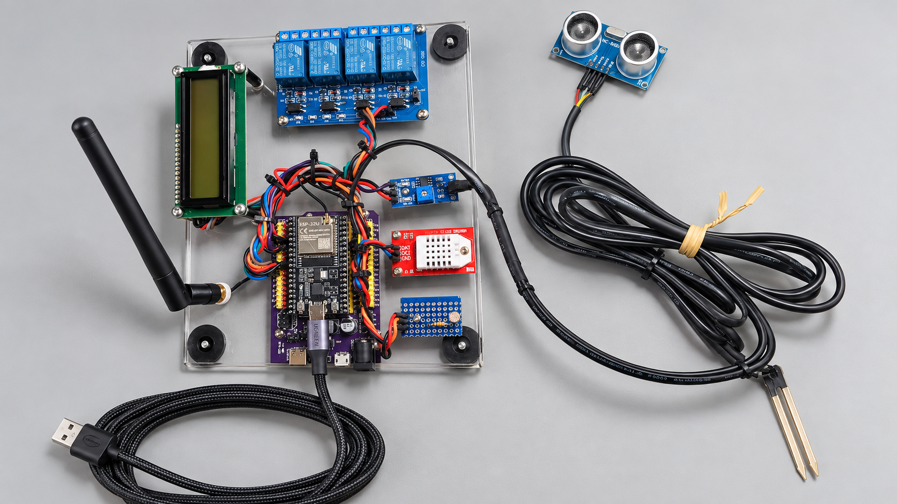
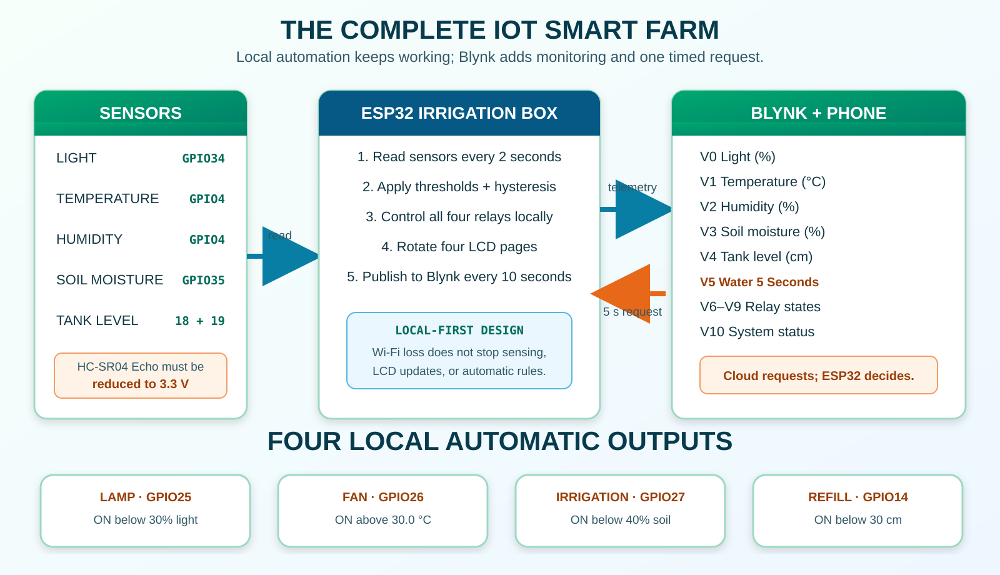
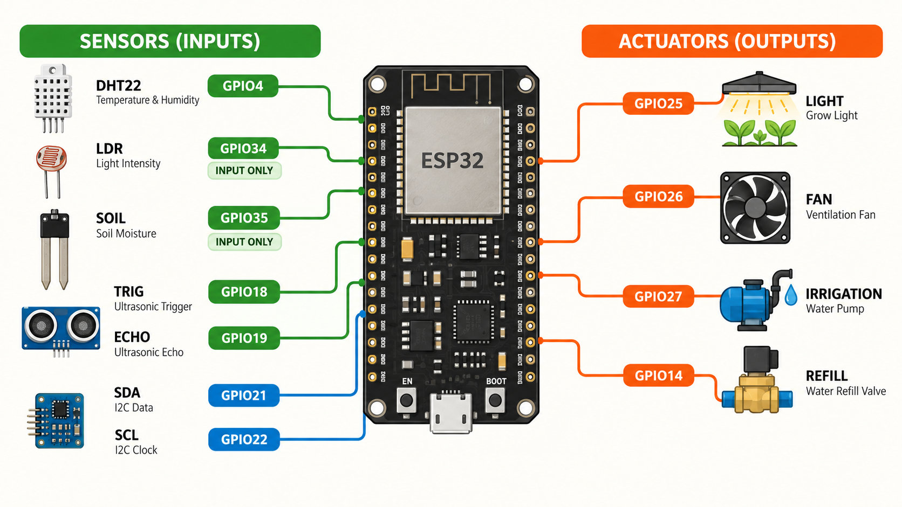
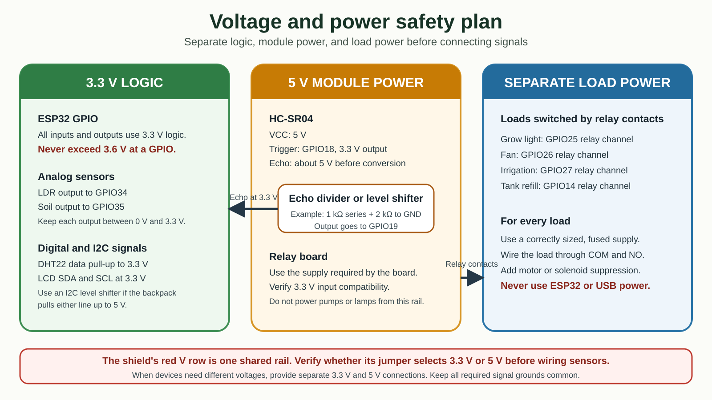
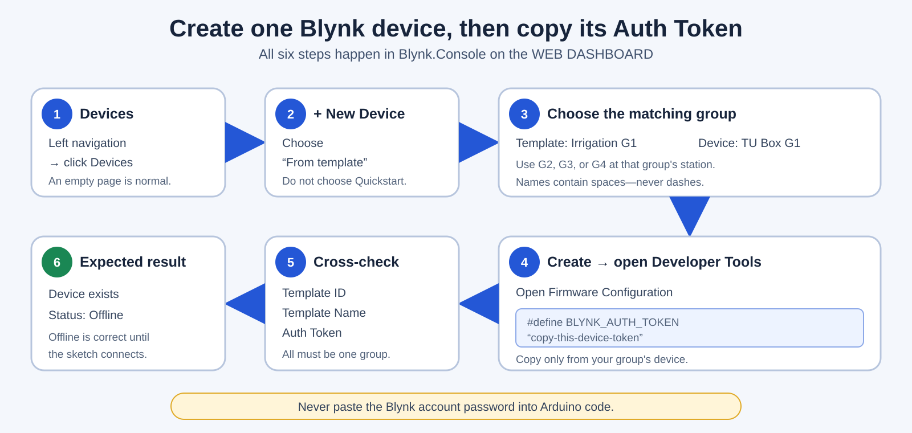
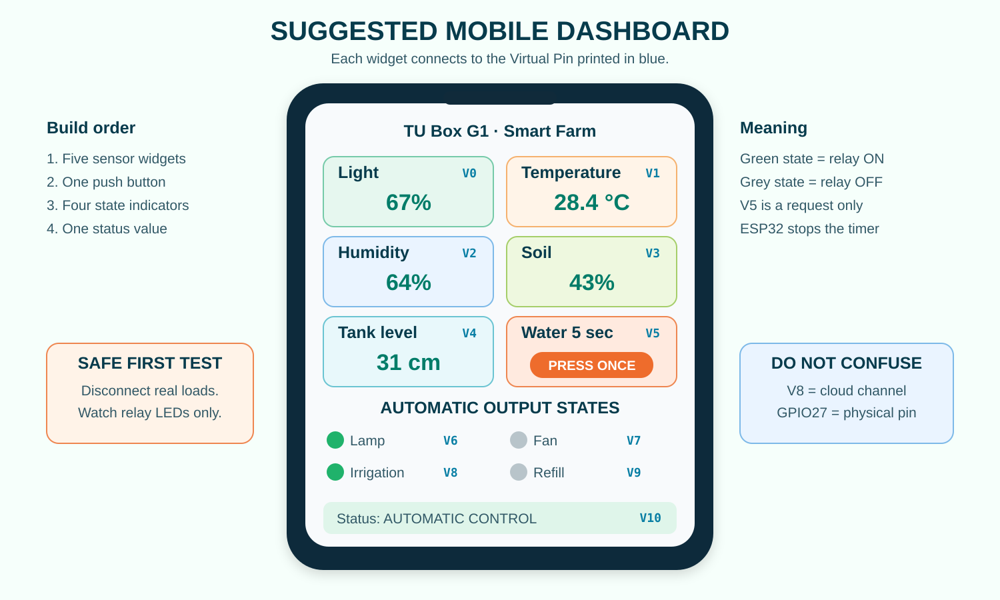

# ESP32 Smart Farm with Blynk: Learner Tutorial

This tutorial turns the complete ESP32 irrigation box into an Internet of Things (IoT) smart farm. You will see five live measurements in Blynk, watch four automatic outputs, use the 16×2 LCD, and send one safe five-second irrigation request from a phone.

By the end, you will be able to:

- explain how the physical box, Wi-Fi, Blynk.Cloud, and phone work together;
- create the correct group template and device in a new Blynk account;
- create and connect eleven Blynk datastreams;
- upload firmware that keeps local automation working even when Wi-Fi is unavailable;
- test the LDR, DHT22, soil sensor, HC-SR04, four relays, LCD, and mobile dashboard; and
- distinguish a physical GPIO pin from a Blynk Virtual Pin.



*Figure 1. The finished ESP32 irrigation box used in this tutorial.*

## Understand the system before building it

### What IoT means in this project

The **Internet of Things** means that a physical object can measure its surroundings, make decisions, and exchange useful information through a network. In this project:

- the **physical thing** is the ESP32 irrigation box;
- its **inputs** are light, temperature, humidity, soil moisture, and tank level;
- its **outputs** are the lamp, fan, irrigation, and refill relay channels;
- the **edge device** is the ESP32 beside the real sensors and relays;
- the **cloud service** is Blynk.Cloud; and
- the **user interface** is the Blynk dashboard on the phone or web browser.

The word **edge** describes where the ESP32 works: at the edge of the network, beside the equipment. It does not mean the Microsoft Edge browser. The ESP32 performs the automatic rules locally, so sensing, LCD pages, and relay decisions continue if the internet connection is lost.



*Figure 2. Five measurements enter the ESP32, four automatic decisions happen locally, and Blynk provides monitoring plus one timed irrigation request.*

**Table 1. Vocabulary used throughout the tutorial.**

| Term | Plain-language meaning | Example in this project |
|---|---|---|
| Template | A reusable blueprint for datastreams and dashboards | `Irrigation G1` |
| Template ID | Blynk's generated identifier for a template | Starts with `TMPL` |
| Device | The cloud record for one physical box | `TU Box G1` |
| Auth Token | The secret that allows one box to sign in as one device | Copied from that device |
| Datastream | A named cloud channel carrying a value | `Light Level` |
| Virtual Pin | The channel number used by firmware and a widget | `V0` through `V10` |
| GPIO | A real electrical pin on the ESP32 | GPIO34 reads the LDR |
| Telemetry | Measurements sent from the box to Blynk | Temperature sent on V1 |
| Request | A command sent from a dashboard to the box | Water for five seconds on V5 |
| Active-low relay | A relay input that turns on at `LOW` and off at `HIGH` | All four workshop relay channels |
| Hysteresis | A small difference between ON and OFF thresholds that prevents rapid clicking | Lamp ON below 30%, OFF at 35% |

> **Do not confuse the two numbering systems:** `V8` is a Blynk cloud channel. `GPIO27` is a physical ESP32 pin. A Virtual Pin never means the same thing as a GPIO with the same number.

## Know the hardware and automatic rules



*Figure 3. Physical connections used by the complete smart-farm firmware.*

**Table 2. Physical pin map for the irrigation box.**

| Hardware function | ESP32 pin | Direction | What the firmware does |
|---|---:|---|---|
| DHT22 data | GPIO4 | Input | Reads temperature and humidity |
| LDR analog output | GPIO34 | Input only | Calculates light percentage |
| Soil sensor analog output | GPIO35 | Input only | Calculates moisture percentage |
| HC-SR04 Trigger | GPIO18 | Output | Sends a 10 µs ultrasonic pulse |
| HC-SR04 Echo | GPIO19 | Input | Measures the returning pulse through a 3.3 V level divider |
| I²C LCD SDA | GPIO21 | Data | Sends text to LCD address `0x27` |
| I²C LCD SCL | GPIO22 | Clock | Clocks the LCD data |
| Relay 1: grow lamp | GPIO25 | Output | Automatic light control |
| Relay 2: fan | GPIO26 | Output | Automatic temperature control |
| Relay 3: irrigation | GPIO27 | Output | Automatic soil control plus a five-second Blynk request |
| Relay 4: tank refill | GPIO14 | Output | Automatic tank-level control |

**Table 3. Automatic rules implemented from the workshop Word material.**

| Function | Turns ON when | Turns OFF when | Why the OFF value differs |
|---|---|---|---|
| Grow lamp | Light is below 30% | Light reaches 35% | Prevents rapid relay clicking near 30% |
| Fan | Temperature is above 30.0 °C | Temperature falls to 29.0 °C | Prevents rapid relay clicking near 30 °C |
| Irrigation | Soil moisture is below 40% | Soil moisture reaches 45% | Allows the reading to move clearly out of the dry range |
| Tank refill | Water level is below 30 cm | Water level reaches 32 cm | Prevents rapid relay clicking as the water surface moves |

The Word source's standalone tank example assigns `waterLevel = 0`, which would keep the refill request active. This learner firmware uses the intended calculation:

```cpp
waterLevelCm = tankHeightCm - distanceCm;
```

It also uses a 30 ms ultrasonic timeout. If no Echo pulse arrives, the firmware reports `CHECK TANK SENSOR` and keeps the refill relay off.

## Electrical safety before powering the box



*Figure 4. A conventional 5 V HC-SR04 needs a divider or level shifter before its Echo signal reaches GPIO19.*

- Keep every ESP32 GPIO signal at or below 3.3 V.
- Reduce a conventional 5 V HC-SR04 Echo signal before GPIO19. A common starting divider is 1 kΩ from Echo to GPIO19 and 2 kΩ from GPIO19 to ground.
- Verify that the LDR and soil-module analog outputs cannot exceed 3.3 V.
- Disconnect every real lamp, fan, pump, valve, and mains-voltage load during the first test. Watch only the four relay indicator LEDs.
- The sketch expects active-low relays: `LOW` means ON and `HIGH` means OFF.
- A relay board may isolate a control signal, but it does not make unsafe wiring safe. Use only supervised low-voltage demonstration loads in this workshop.
- Return to the [standalone hardware tutorial](README.md) if any sensor or relay channel has not passed its local test.

## Shared account, exact group names, and Wi-Fi

Use the classroom Blynk account:

```text
itetu.training@gmail.com
```

The account password is provided by the facilitator and must never be placed in the Arduino sketch. The temporary workshop Wi-Fi name and password are intentionally placed in the sketch so the ESP32 can join the classroom network.

**Table 4. Exact Blynk names assigned to each group.**

| Group | Template Name | Device Name |
|---:|---|---|
| 1 | `Irrigation G1` | `TU Box G1` |
| 2 | `Irrigation G2` | `TU Box G2` |
| 3 | `Irrigation G3` | `TU Box G3` |
| 4 | `Irrigation G4` | `TU Box G4` |

Use the names exactly. A Blynk template name in this workshop uses a space before `G` and **must not contain a dash or hyphen**.

## Learning path and jump links

**Table 5. Main learning path. Select a Part link to jump directly to it.**

| Part | Main action | Location | What changes there |
|---|---|---|---|
| [Part 1](#part-1-install-and-check-the-arduino-libraries) | Install libraries | ESP irrigation box computer | Arduino IDE gains the Blynk, DHT22, sensor, and LCD code it needs |
| [Part 2](#part-2-open-the-new-account-and-enable-build-tools) | Open the new account | Web dashboard, then mobile device | Developer Zone becomes visible; mobile editing is enabled |
| [Part 3](#part-3-create-the-assigned-group-template) | Create a template | Web dashboard | The group's reusable blueprint is created |
| [Part 4](#part-4-create-all-eleven-datastreams) | Create datastreams | Web dashboard | V0–V10 receive names, types, and limits |
| [Part 5](#part-5-create-the-group-device-and-copy-its-three-blynk-values) | Create a device | Web dashboard | One cloud device and Auth Token are created for the physical box |
| [Part 6](#part-6-build-the-mobile-dashboard) | Build widgets | Mobile device | The learner creates the live phone interface |
| [Part 7](#part-7-build-verify-and-upload-the-complete-firmware) | Upload firmware | ESP irrigation box computer | The box gains all smart-farm and Blynk features |
| [Part 8](#part-8-confirm-wi-fi-blynk-and-the-edge-device) | Confirm connection | ESP box, web dashboard, mobile device | The physical box and cloud device become one working system |
| [Part 9](#part-9-test-every-feature-without-real-loads) | Test inputs and relay LEDs | ESP irrigation box and mobile device | Every sensor, rule, LCD page, state, and request is checked safely |
| [Part 10](#part-10-run-a-supervised-low-voltage-water-test) | Test water | ESP irrigation box and mobile device | A low-voltage irrigation load is tested under supervision |
| [Part 11](#part-11-calibrate-the-real-box) | Calibrate | ESP irrigation box computer | Raw sensor limits and tank height are matched to the real hardware |

## Part 1: Install and check the Arduino libraries

### 1.A — Install the board package and managed libraries

> **Where:** ESP irrigation box computer — Arduino IDE.

1. Open **Arduino IDE**.
2. Open **Tools > Board > Boards Manager**.
3. Search for `esp32` and install **esp32 by Espressif Systems, version 2.0.17**.
4. Open **Sketch > Include Library > Manage Libraries**.
5. Search for `Blynk` and install **Blynk version 1.3.5**.
6. Search for `DHT sensor library`, select **DHT sensor library by Adafruit**, and install it.
7. Accept the prompt to install **Adafruit Unified Sensor** if it appears. If it does not, search for that exact name and install it separately.

### 1.B — Install the supplied LCD library

> **Where:** ESP irrigation box computer — File Explorer, then Arduino IDE.

1. Close Arduino IDE.
2. In this repository, open `arduino-libraries`.
3. Copy the folder `Arduino-LiquidCrystal-I2C-library-master` into the Arduino sketchbook's `libraries` folder. The usual Windows location is `Documents\Arduino\libraries`.
4. Reopen Arduino IDE.
5. Open **File > Examples** and confirm that LiquidCrystal I2C examples are visible.

### 1.C — Select the board and USB port

> **Where:** ESP irrigation box computer — Arduino IDE, with the physical box connected by USB.

1. Connect the ESP32 with a known USB **data** cable.
2. Select **Tools > Board > esp32 > ESP32 Dev Module**.
3. Open **Tools > Port** and select the port that appeared when the box was connected.
4. Leave **Partition Scheme** at its normal `Default 4MB with spiffs` setting. The verified firmware fits the standard application partition.

**Checkpoint 1:** Arduino IDE shows **ESP32 Dev Module**, a valid COM port, and the four required libraries are installed.

## Part 2: Open the new account and enable build tools

The account may begin on an empty **Devices** page. That is normal: no class template or class device exists yet.

### 2.A — Sign in and reach Devices

> **Where:** Web dashboard — a desktop or laptop browser.

1. Open [Blynk.Console](https://blynk.cloud/).
2. Sign in as `itetu.training@gmail.com` using the password provided for the workshop.
3. If a generic Quickstart walkthrough opens, close it with the visible **X**, **Back**, or **Skip** control. Do not create a Quickstart device.
4. Select **Devices** in the left navigation. Seeing an empty list is correct.

### 2.B — Turn on Developer Mode

> **Where:** Web dashboard — Blynk.Console.

1. Click the profile icon in the upper-right corner.
2. Open **User Profile** or **Profile**.
3. Find **Developer Mode** and turn it **ON**.
4. Return to the main console.
5. Confirm that **Developer Zone** now appears in the left navigation.


*Figure 5. The four visual landmarks for making Developer Zone appear. This is a learning diagram, so the exact spacing may differ from the live site.*

### 2.C — Prepare the mobile app

> **Where:** Mobile device — Blynk IoT app.

1. Install or open **Blynk IoT**.
2. Sign in as `itetu.training@gmail.com`.
3. Open the profile area and turn **Developer Mode** ON if the app shows that option.
4. Return to **Devices**. The page may still be empty until Part 5.

**Checkpoint 2:** The web dashboard shows **Developer Zone**, and the phone is signed into the same shared account.

## Part 3: Create the assigned group template

### 3.A — Check whether the group template already exists

> **Where:** Web dashboard — Blynk.Console.

1. Click **Developer Zone**.
2. Read the template names already shown.
3. If your exact assigned name from Table 4 already exists, open it and continue to Part 4. Do not create a duplicate.
4. If it does not exist, continue to 3.B.

### 3.B — Create the template

> **Where:** Web dashboard — Developer Zone.

1. Click **+ New Template**.
2. In **Template Name**, enter your assigned name exactly, for example `Irrigation G1`.
3. In **Hardware**, select **ESP32**.
4. In **Connection Type**, select **WiFi**.
5. Click **Done**, **Create**, or the visible confirmation button.
6. Confirm that the template workspace opens and shows tabs such as **Info**, **Datastreams**, **Events**, and **Web Dashboard**.


*Figure 6. Template creation example for Group 1. Other groups replace only the final group number.*

**Checkpoint 3:** The open template name is exactly `Irrigation G1`, `Irrigation G2`, `Irrigation G3`, or `Irrigation G4`, with a space and no dash.

## Part 4: Create all eleven datastreams

A datastream defines the name, data type, range, unit, and Virtual Pin of one cloud value. Widgets are connected later; first the channels must exist.

**Table 6. Complete datastream specification for every group template.**

| Name | Virtual Pin | Data Type | Min | Max | Unit | Direction |
|---|---|---|---:|---:|---|---|
| Light Level | V0 | Integer | 0 | 100 | `%` | Box → Blynk |
| Temperature | V1 | Double | -10 | 60 | `°C` | Box → Blynk |
| Humidity | V2 | Double | 0 | 100 | `%` | Box → Blynk |
| Soil Moisture | V3 | Integer | 0 | 100 | `%` | Box → Blynk |
| Tank Level | V4 | Integer | 0 | 45 | `cm` | Box → Blynk |
| Water 5 Seconds | V5 | Integer | 0 | 1 | leave blank | Blynk → box |
| Lamp State | V6 | Enumerable | 0 = OFF | 1 = ON | leave blank | Box → Blynk |
| Fan State | V7 | Enumerable | 0 = OFF | 1 = ON | leave blank | Box → Blynk |
| Irrigation State | V8 | Enumerable | 0 = OFF | 1 = ON | leave blank | Box → Blynk |
| Refill State | V9 | Enumerable | 0 = OFF | 1 = ON | leave blank | Box → Blynk |
| System Status | V10 | String | not shown | not shown | leave blank | Box → Blynk |

### 4.A — Open the Datastreams editor

> **Where:** Web dashboard — inside the assigned group template.

1. Click the **Datastreams** tab.
2. If any rows already exist, compare each one with Table 6 before adding anything.
3. Click **+ New Datastream** or **Add Datastream**.
4. Choose **Virtual Pin**.

### 4.B — Create V0 together

> **Where:** Web dashboard — Datastreams editor.

1. Enter `Light Level` for **Name**.
2. Choose `V0` for **Pin**.
3. Choose **Integer** for **Data Type**.
4. Enter `0` for **Min** and `100` for **Max**.
5. Enter `%` for **Units**.
6. Leave advanced settings at their defaults.
7. Click **Create** or **Save**.
8. Confirm that a `Light Level` row with V0 appears.

### 4.C — Create V1 through V5

> **Where:** Web dashboard — Datastreams editor.

Repeat **+ New Datastream > Virtual Pin** for the next five rows in Table 6. Check the name, pin, type, limits, and unit before saving each row. `Temperature` and `Humidity` use **Double** so Blynk can show decimal values; `Water 5 Seconds` uses **Integer 0–1** because it is a button request.

### 4.D — Create the four output states

> **Where:** Web dashboard — Datastreams editor.

For V6, V7, V8, and V9:

1. Click **+ New Datastream**.
2. Choose **Enumerable**.
3. Enter the exact name and Virtual Pin from Table 6.
4. Add row value `0` with label `OFF`.
5. Add row value `1` with label `ON`.
6. Save and repeat for the next output.

### 4.E — Create the status and verify the list

> **Where:** Web dashboard — Datastreams editor.

1. Add one more Virtual Pin datastream.
2. Name it `System Status`, choose `V10`, and choose **String**.
3. Save it.
4. Count the list: there must be exactly eleven workshop rows.
5. Confirm that V0 through V10 each appear once, in order, with no duplicate pin.

### 4.F — Connect each relay to its GPIO and Blynk feedback

> **Where:** Web dashboard or mobile device — the live group-device dashboard after the ESP32 connects.

The four relay-state datastreams are **feedback from the ESP32**. They report what the physical relay outputs are doing after the local automatic rules and any manual watering request have been combined.

**Table 7. End-to-end relay, GPIO, automatic-rule, and Blynk-state mapping.**

| Relay channel | Physical function | ESP32 output | Automatic rule | Blynk state datastream | `0` means | `1` means |
|---:|---|---:|---|---|---|---|
| Relay 1 | Grow lamp | GPIO25 | ON below 30%; OFF at 35% | Lamp State (V6) | Lamp OFF | Lamp ON |
| Relay 2 | Ventilation fan | GPIO26 | ON above 30.0 °C; OFF at 29.0 °C | Fan State (V7) | Fan OFF | Fan ON |
| Relay 3 | Irrigation or spray | GPIO27 | ON below 40%; OFF at 45% | Irrigation State (V8) | Irrigation OFF | Irrigation ON |
| Relay 4 | Tank refill | GPIO14 | ON below 30 cm; OFF at 32 cm | Refill State (V9) | Refill OFF | Refill ON |

`Water 5 Seconds (V5)` is deliberately absent from the relay-state column. V5 is an **input request** from the dashboard, while V8 is the **actual irrigation-output feedback** returned by the ESP32.

For example, the sequence below is read in V6, V7, V8, V9 order:

```text
0, 1, 1, 0
│  │  │  └─ Refill OFF
│  │  └──── Irrigation ON
│  └─────── Fan ON
└────────── Lamp OFF
```

This sequence does not by itself mean the dashboard is frozen. It means the current sensor readings have not crossed an OFF or ON threshold. In particular, if V8 is already `1` because the soil is dry, pressing V5 cannot make the irrigation relay look more ON. Part 9.B therefore makes the soil moist and gets V8 to `0` before testing the five-second request.

**Checkpoint 4:** Tables 6 and 7 agree with the live Datastreams list, and you can explain both V5 and the four state values without confusing them with GPIO numbers.

## Part 5: Create the group device and copy its three Blynk values

The **Template Name** and **Template ID** identify the blueprint. The **Auth Token** identifies one device made from that blueprint. All three values must belong to the same group.

**Table 8. The three Blynk values that will be pasted into the firmware.**

| Value | Where it comes from | Example shape |
|---|---|---|
| Template Name | The exact group name from Part 3 | `Irrigation G1` |
| Template ID | The template's **Info** tab | `TMPL...` |
| Auth Token | The created device's **Device Info** or **Developer Tools** | A long device secret |

### 5.A — Record the Template Name and Template ID

> **Where:** Web dashboard — assigned group template.

1. Click the template's **Info** tab.
2. Copy **Template ID** with its copy icon. It begins with `TMPL`.
3. Record the visible **Template Name** exactly, including the space before `G`.
4. Keep both values in a temporary group note. Do not use another group's values.


*Figure 7. The Template ID is on the template's Info tab; it is not the device Auth Token.*

### 5.B — Create one device from the template

> **Where:** Web dashboard — Blynk.Console Devices page.

1. Click **Devices** in the left navigation.
2. Click **+ New Device**.
3. Choose **From template**.
4. Select your exact template, such as `Irrigation G1`.
5. Enter the exact device name from Table 4, such as `TU Box G1`.
6. Click **Create**.
7. Open the new device tile and confirm the device name and template name both belong to your group.

### 5.C — Copy the device Auth Token

> **Where:** Web dashboard — the newly created group device.

1. Open the device's **Device Info** or **Developer Tools** area. Depending on window width, it may be behind a wrench, settings icon, three-dot menu, or the **Developer Tools** tab.
2. Find **Auth Token**.
3. Click its copy icon and place it in the group note with the Template ID and Template Name.
4. Confirm that you copied the token from `TU Box G1`, `TU Box G2`, `TU Box G3`, or `TU Box G4`—not from a different device.



*Figure 8. Manual device activation links one template, one device, one Auth Token, and one physical ESP32.*

If **Auth Token** is not visible, widen the browser, open the device rather than the template, and look for **Device Info** or **Developer Tools**. Do not create a second device merely because a panel is collapsed.

**Checkpoint 5:** The group note contains exactly one Template Name, one `TMPL...` Template ID, and one Auth Token from the matching device.

## Part 6: Build the mobile dashboard

The mobile and web dashboards are separate layouts. This Part builds the phone layout. The widgets will show no live values until the firmware connects in Part 8.



*Figure 9. Suggested learner layout with five measurements, one timed request, four output states, and one status field.*

**Table 9. Widget-to-datastream map for the mobile dashboard.**

| Widget title | Suggested widget | Datastream |
|---|---|---|
| Light Level | Gauge or Labeled Value | Light Level (V0) |
| Temperature | Labeled Value | Temperature (V1) |
| Humidity | Gauge or Labeled Value | Humidity (V2) |
| Soil Moisture | Gauge | Soil Moisture (V3) |
| Tank Level | Level or Labeled Value | Tank Level (V4) |
| Water 5 Seconds | Button | Water 5 Seconds (V5) |
| Lamp State | LED or Labeled Value | Lamp State (V6) |
| Fan State | LED or Labeled Value | Fan State (V7) |
| Irrigation State | LED or Labeled Value | Irrigation State (V8) |
| Refill State | LED or Labeled Value | Refill State (V9) |
| System Status | Labeled Value | System Status (V10) |

### 6.A — Open the correct mobile template

> **Where:** Mobile device — Blynk IoT app.

1. Confirm that `itetu.training@gmail.com` is signed in.
2. Open the profile area and confirm **Developer Mode** is ON.
3. Open **Developer Zone**, **Templates**, or the template-editing area shown by the current app version.
4. Select your exact `Irrigation G#` template—not another group's device tile.
5. Open its mobile dashboard editor. Look for an empty canvas and a **+** button.

### 6.B — Add the five sensor widgets

> **Where:** Mobile device — mobile template editor.

For each of the first five rows in Table 9:

1. Tap **+** or tap an empty area of the canvas.
2. Choose the suggested widget. If **Gauge** or **Level** is unavailable, use **Labeled Value**.
3. Open the widget settings.
4. Tap **Datastream** and choose the exact named datastream and Virtual Pin.
5. Set the widget title to the name in Table 9.
6. Close the settings to save, then repeat for the next sensor.

### 6.C — Add the five-second request button

> **Where:** Mobile device — mobile template editor.

1. Tap **+** and choose **Button**.
2. Connect it to `Water 5 Seconds (V5)`.
3. Set the title to `Water 5 Seconds`.
4. Set OFF to `0` and ON to `1` if those fields are shown.
5. Choose **Push** or **Momentary** mode if available. If only Switch mode is available, keep it; the ESP32 resets V5 to 0 after accepting the request.
6. Do not test the button yet.

The V5 widget is a request button, not a fifth relay indicator. When automatic irrigation is currently OFF, a successful request briefly changes the actual irrigation feedback on V8 and changes `System Status (V10)` to a manual-watering message.

### 6.D — Add the four output states and system status

> **Where:** Mobile device — mobile template editor.

1. Add an **LED** or **Labeled Value** for `Lamp State (V6)`.
2. Repeat for `Fan State (V7)`, `Irrigation State (V8)`, and `Refill State (V9)`.
3. Add a **Labeled Value** for `System Status (V10)`.
4. Arrange these five widgets below the sensor values and request button.
5. Place them left to right or top to bottom in V6, V7, V8, V9 order: **Lamp, Fan, Irrigation, Refill**. This makes a sequence such as `0,1,1,0` readable using Table 7.

### 6.E — Verify the mobile layout

> **Where:** Mobile device — mobile template editor and Devices page.

1. Compare every widget with Table 9.
2. Check especially that `Temperature` uses V1, `Humidity` uses V2, and `Water 5 Seconds` uses V5.
3. Leave the editor and open **Devices**.
4. Confirm that the matching `TU Box G#` tile exists. **Offline** is expected before Part 8.

**Checkpoint 6:** Eleven widgets exist and each is connected to its matching named datastream.

## Part 7: Build, verify, and upload the complete firmware

### 7.A — Open the supplied sketch

> **Where:** ESP irrigation box computer — File Explorer and Arduino IDE.

1. Open [`examples/irrigation_blynk/irrigation_blynk.ino`](examples/irrigation_blynk/irrigation_blynk.ino).
2. Arduino IDE may ask to place it in a folder named `irrigation_blynk`; accept that normal Arduino sketch structure.
3. Save a group copy, for example `Smart_Farm_Blynk_G1`.
4. Confirm that the sketch contains only one `.ino` tab.

### 7.B — Paste the five workshop values

> **Where:** ESP irrigation box computer — at the top of the Arduino sketch.

Replace only the five placeholder strings:

```cpp
#define BLYNK_TEMPLATE_ID   "PASTE_TEMPLATE_ID_HERE"
#define BLYNK_TEMPLATE_NAME "PASTE_TEMPLATE_NAME_HERE"
#define BLYNK_AUTH_TOKEN    "PASTE_DEVICE_AUTH_TOKEN_HERE"

char wifiName[] = "PASTE_WORKSHOP_WIFI_NAME_HERE";
char wifiPassword[] = "PASTE_WORKSHOP_WIFI_PASSWORD_HERE";
```

For Group 1, the Template Name line must look exactly like this:

```cpp
#define BLYNK_TEMPLATE_NAME "Irrigation G1"
```

Keep the quotation marks. Do not paste the shared Blynk account password into the sketch. The Auth Token comes from the device in Part 5; it is not the Template ID.

### 7.C — Complete learner firmware

> **Where:** ESP irrigation box computer — Arduino IDE. This listing is identical to the supplied `.ino` file before credentials are inserted.

```cpp
#define BLYNK_PRINT Serial

// ---------- COPY YOUR FIVE WORKSHOP VALUES HERE ----------
#define BLYNK_TEMPLATE_ID   "PASTE_TEMPLATE_ID_HERE"
#define BLYNK_TEMPLATE_NAME "PASTE_TEMPLATE_NAME_HERE"
#define BLYNK_AUTH_TOKEN    "PASTE_DEVICE_AUTH_TOKEN_HERE"

char wifiName[] = "PASTE_WORKSHOP_WIFI_NAME_HERE";
char wifiPassword[] = "PASTE_WORKSHOP_WIFI_PASSWORD_HERE";
// --------------------------------------------------------

#include <Wire.h>
#include <LiquidCrystal_I2C.h>
#include <DHT.h>
#include <WiFi.h>
#include <WiFiClient.h>
#include <BlynkSimpleEsp32.h>

// ----------------------- Hardware -----------------------
const int dhtPin = 4;
const int ldrPin = 34;
const int soilPin = 35;
const int trigPin = 18;
const int echoPin = 19;

const int lampRelay = 25;
const int fanRelay = 26;
const int irrigationRelay = 27;
const int refillRelay = 14;

const int relayOn = LOW;    // The workshop relay board is active-low.
const int relayOff = HIGH;

DHT dht(dhtPin, DHT22);
LiquidCrystal_I2C lcd(0x27, 16, 2);

// -------------------- Sensor calibration ----------------
// Change these values after measuring the actual box.
const int lightRawDark = 2500;
const int lightRawBright = 4095;
const int soilRawDry = 4095;
const int soilRawWet = 2000;
const int tankHeightCm = 45;

// -------------------- Control thresholds ----------------
const int lightOnBelowPercent = 30;
const int lightOffAtPercent = 35;
const float fanOnAboveC = 30.0;
const float fanOffAtC = 29.0;
const int irrigationOnBelowPercent = 40;
const int irrigationOffAtPercent = 45;
const int refillOnBelowCm = 30;
const int refillOffAtCm = 32;

const unsigned long manualWateringTimeMs = 5000;
const unsigned long sensorIntervalMs = 2000;
const unsigned long cloudIntervalMs = 10000;
const unsigned long lcdIntervalMs = 2000;
const unsigned long blynkReconnectIntervalMs = 10000;

// ----------------------- Live data -----------------------
int lightPercent = 0;
int soilPercent = 0;
int waterLevelCm = 0;
float temperatureC = 0.0;
float humidityPercent = 0.0;
bool dhtValid = false;
bool tankValid = false;

bool lampOn = false;
bool fanOn = false;
bool automaticIrrigationOn = false;
bool manualIrrigationOn = false;
bool irrigationOn = false;
bool refillOn = false;

unsigned long manualWateringStartedAt = 0;
unsigned long lastSensorReadAt = 0;
unsigned long lastCloudPublishAt = 0;
unsigned long lastLcdChangeAt = 0;
unsigned long lastBlynkConnectAttemptAt = 0;
byte lcdPage = 0;

// --------------------- Helper functions ------------------
void setRelay(int pin, bool turnOn) {
  digitalWrite(pin, turnOn ? relayOn : relayOff);
}

int readTankLevelCm() {
  digitalWrite(trigPin, LOW);
  delayMicroseconds(2);
  digitalWrite(trigPin, HIGH);
  delayMicroseconds(10);
  digitalWrite(trigPin, LOW);

  // Stop waiting after 30 ms so a missing echo cannot freeze the program.
  unsigned long durationUs = pulseIn(echoPin, HIGH, 30000UL);
  if (durationUs == 0) {
    tankValid = false;
    return waterLevelCm;
  }

  float distanceCm = durationUs * 0.0343f / 2.0f;
  int level = tankHeightCm - (int)(distanceCm + 0.5f);
  tankValid = true;
  return constrain(level, 0, tankHeightCm);
}

void updateAutomaticOutputs() {
  if (!lampOn && lightPercent < lightOnBelowPercent) {
    lampOn = true;
  } else if (lampOn && lightPercent >= lightOffAtPercent) {
    lampOn = false;
  }

  if (!dhtValid) {
    fanOn = false;
  } else if (!fanOn && temperatureC > fanOnAboveC) {
    fanOn = true;
  } else if (fanOn && temperatureC <= fanOffAtC) {
    fanOn = false;
  }

  if (!automaticIrrigationOn && soilPercent < irrigationOnBelowPercent) {
    automaticIrrigationOn = true;
  } else if (automaticIrrigationOn && soilPercent >= irrigationOffAtPercent) {
    automaticIrrigationOn = false;
  }

  // A missing ultrasonic echo must leave the refill pump off.
  if (!tankValid) {
    refillOn = false;
  } else if (!refillOn && waterLevelCm < refillOnBelowCm) {
    refillOn = true;
  } else if (refillOn && waterLevelCm >= refillOffAtCm) {
    refillOn = false;
  }

  irrigationOn = automaticIrrigationOn || manualIrrigationOn;
  setRelay(lampRelay, lampOn);
  setRelay(fanRelay, fanOn);
  setRelay(irrigationRelay, irrigationOn);
  setRelay(refillRelay, refillOn);
}

void readSensors() {
  int lightRaw = analogRead(ldrPin);
  int soilRaw = analogRead(soilPin);

  lightPercent = map(lightRaw, lightRawDark, lightRawBright, 0, 100);
  lightPercent = constrain(lightPercent, 0, 100);
  soilPercent = map(soilRaw, soilRawDry, soilRawWet, 0, 100);
  soilPercent = constrain(soilPercent, 0, 100);

  float newTemperature = dht.readTemperature();
  float newHumidity = dht.readHumidity();
  dhtValid = !isnan(newTemperature) && !isnan(newHumidity);
  if (dhtValid) {
    temperatureC = newTemperature;
    humidityPercent = newHumidity;
  }

  waterLevelCm = readTankLevelCm();
  updateAutomaticOutputs();

  Serial.print("Light: ");
  Serial.print(lightPercent);
  Serial.print("%  Temp: ");
  if (dhtValid) Serial.print(temperatureC, 1); else Serial.print("ERROR");
  Serial.print(" C  Humidity: ");
  if (dhtValid) Serial.print(humidityPercent, 0); else Serial.print("ERROR");
  Serial.print("%  Soil: ");
  Serial.print(soilPercent);
  Serial.print("%  Tank: ");
  if (tankValid) Serial.print(waterLevelCm); else Serial.print("ERROR");
  Serial.print(" cm  Relays L/F/I/R: ");
  Serial.print(lampOn);
  Serial.print('/');
  Serial.print(fanOn);
  Serial.print('/');
  Serial.print(irrigationOn);
  Serial.print('/');
  Serial.println(refillOn);
}

const char* systemStatus() {
  if (!dhtValid) return "CHECK DHT22";
  if (!tankValid) return "CHECK TANK SENSOR";
  if (manualIrrigationOn && automaticIrrigationOn) return "AUTO + MANUAL WATER";
  if (manualIrrigationOn) return "MANUAL WATER 5 SEC";
  return "AUTOMATIC CONTROL";
}

void publishToBlynk() {
  if (!Blynk.connected()) {
    return;
  }

  Blynk.virtualWrite(V0, lightPercent);
  if (dhtValid) {
    Blynk.virtualWrite(V1, temperatureC);
    Blynk.virtualWrite(V2, humidityPercent);
  }
  Blynk.virtualWrite(V3, soilPercent);
  if (tankValid) {
    Blynk.virtualWrite(V4, waterLevelCm);
  }
  Blynk.virtualWrite(V6, lampOn ? 1 : 0);
  Blynk.virtualWrite(V7, fanOn ? 1 : 0);
  Blynk.virtualWrite(V8, irrigationOn ? 1 : 0);
  Blynk.virtualWrite(V9, refillOn ? 1 : 0);
  Blynk.virtualWrite(V10, systemStatus());
}

void showLcdPage() {
  lcd.setCursor(0, 0);
  if (lcdPage == 0) {
    lcd.print("Light:");
    lcd.print(lightPercent);
    lcd.print("%       ");
    lcd.setCursor(0, 1);
    lcd.print("Lamp:");
    lcd.print(lampOn ? "ON " : "OFF");
    lcd.print("         ");
  } else if (lcdPage == 1) {
    lcd.print("Temp:");
    if (dhtValid) lcd.print(temperatureC, 1); else lcd.print("ERR");
    lcd.print("C      ");
    lcd.setCursor(0, 1);
    lcd.print("Hum:");
    if (dhtValid) lcd.print(humidityPercent, 0); else lcd.print("ERR");
    lcd.print("% Fan:");
    lcd.print(fanOn ? "ON " : "OFF");
  } else if (lcdPage == 2) {
    lcd.print("Soil:");
    lcd.print(soilPercent);
    lcd.print("%       ");
    lcd.setCursor(0, 1);
    lcd.print("Water:");
    lcd.print(irrigationOn ? "ON " : "OFF");
    lcd.print("       ");
  } else {
    lcd.print("Tank:");
    if (tankValid) lcd.print(waterLevelCm); else lcd.print("ERR");
    lcd.print("cm       ");
    lcd.setCursor(0, 1);
    lcd.print("Refill:");
    lcd.print(refillOn ? "ON " : "OFF");
    lcd.print("      ");
  }
  lcdPage = (lcdPage + 1) % 4;
}

void startManualWatering() {
  manualIrrigationOn = true;
  manualWateringStartedAt = millis();
  updateAutomaticOutputs();
  publishToBlynk();
}

void updateManualWateringTimer() {
  if (manualIrrigationOn &&
      millis() - manualWateringStartedAt >= manualWateringTimeMs) {
    manualIrrigationOn = false;
    updateAutomaticOutputs();
    publishToBlynk();
  }
}

// The mobile button sends 1 on Virtual Pin V5.
BLYNK_WRITE(V5) {
  if (param.asInt() == 1) {
    startManualWatering();
    Blynk.virtualWrite(V5, 0);
  }
}

BLYNK_CONNECTED() {
  Blynk.virtualWrite(V5, 0);
  publishToBlynk();
}

void maintainCloudConnection() {
  if (WiFi.status() != WL_CONNECTED || Blynk.connected()) {
    return;
  }

  unsigned long now = millis();
  if (now - lastBlynkConnectAttemptAt >= blynkReconnectIntervalMs) {
    lastBlynkConnectAttemptAt = now;
    Serial.println("Wi-Fi connected; trying Blynk.Cloud...");
    Blynk.connect(1000);
  }
}

void setup() {
  Serial.begin(115200);
  delay(100);

  // Load the OFF level before each pin becomes an output.
  digitalWrite(lampRelay, relayOff);
  digitalWrite(fanRelay, relayOff);
  digitalWrite(irrigationRelay, relayOff);
  digitalWrite(refillRelay, relayOff);
  pinMode(lampRelay, OUTPUT);
  pinMode(fanRelay, OUTPUT);
  pinMode(irrigationRelay, OUTPUT);
  pinMode(refillRelay, OUTPUT);

  pinMode(ldrPin, INPUT);
  pinMode(soilPin, INPUT);
  pinMode(trigPin, OUTPUT);
  pinMode(echoPin, INPUT);

  dht.begin();
  lcd.begin();
  lcd.backlight();
  lcd.setCursor(0, 0);
  lcd.print("Smart Farm IoT  ");
  lcd.setCursor(0, 1);
  lcd.print("Starting...     ");

  readSensors();
  lastSensorReadAt = millis();
  lastCloudPublishAt = millis();
  lastLcdChangeAt = millis();

  // Connect without blocking the local smart-farm control loop.
  WiFi.mode(WIFI_STA);
  WiFi.begin(wifiName, wifiPassword);
  Blynk.config(BLYNK_AUTH_TOKEN);
  lastBlynkConnectAttemptAt = millis() - blynkReconnectIntervalMs;
  Serial.println("Local automatic control is running; connecting to Wi-Fi...");
}

void loop() {
  maintainCloudConnection();
  if (Blynk.connected()) {
    Blynk.run();
  }
  updateManualWateringTimer();

  unsigned long now = millis();
  if (now - lastSensorReadAt >= sensorIntervalMs) {
    lastSensorReadAt = now;
    readSensors();
  }
  if (now - lastLcdChangeAt >= lcdIntervalMs) {
    lastLcdChangeAt = now;
    showLcdPage();
  }
  if (now - lastCloudPublishAt >= cloudIntervalMs) {
    lastCloudPublishAt = now;
    publishToBlynk();
  }
}

```

### 7.D — Understand the important program jobs

> **Where:** ESP irrigation box computer — read the sketch in Arduino IDE; observe the physical box while discussing it.

**Table 10. How the complete firmware is divided into understandable jobs.**

| Code area | Job |
|---|---|
| Hardware constants | Match sensors, LCD, and relays to the GPIO pin map |
| Calibration constants | Convert raw LDR and soil readings into percentages and define tank height |
| Threshold constants | Reproduce the four smart-farm decisions with hysteresis |
| `readSensors()` | Reads five measurements every two seconds and updates automatic outputs |
| `readTankLevelCm()` | Uses a timeout and calculates `tank height − air gap` |
| `updateAutomaticOutputs()` | Controls all four active-low relay channels locally |
| `showLcdPage()` | Rotates four readable pages without blocking the cloud connection |
| `publishToBlynk()` | Sends five measurements, four states, and status every ten seconds |
| `BLYNK_WRITE(V5)` | Accepts one manual five-second irrigation request |
| `maintainCloudConnection()` | Reconnects Blynk without stopping the local farm logic |

The manual request and automatic soil rule both control GPIO27. When soil is already at or above 45%, a V5 request turns irrigation on for about five seconds and then off. When soil remains below 40%, the automatic rule still requires irrigation, so GPIO27 can correctly remain on after the manual five-second request ends.

### 7.E — Verify and upload

> **Where:** ESP irrigation box computer — Arduino IDE; physical loads remain disconnected.

1. Confirm again that real loads are disconnected from all relay screw terminals.
2. Select **ESP32 Dev Module** and the correct COM port.
3. Click **Verify**.
4. With ESP32 core 2.0.17 and Blynk 1.3.5, the checked learner sketch uses **763,965 bytes (58%)** of the 1,310,720-byte application space and **45,544 bytes (13%)** of dynamic memory. Small byte-count differences are normal; an unexpectedly near-full sketch usually means the wrong sketch tabs, board package, or project were selected.
5. Correct any missing-library error before continuing.
6. Click **Upload**.
7. Wait for **Done uploading**.
8. If Arduino IDE shows a COM-port error, close other Serial Monitor windows, reconnect the USB data cable, reselect the port, and upload again.

**Checkpoint 7:** Upload succeeds, all four relay channels begin in their safe OFF state, and the LCD shows `Smart Farm IoT` while startup begins.

## Part 8: Confirm Wi-Fi, Blynk, and the edge device

### 8.A — Observe the physical edge device

> **Where:** ESP irrigation box computer — Arduino IDE Serial Monitor and the physical box.

1. Open **Tools > Serial Monitor**.
2. Set the rate to **115200 baud**.
3. Press the ESP32 **EN/Reset** button once.
4. Look for `Local automatic control is running; connecting to Wi-Fi...`.
5. Confirm that sensor lines continue every two seconds even before the cloud connects. This proves local control is not waiting for the internet.
6. Look for `Wi-Fi connected; trying Blynk.Cloud...` and Blynk's connection message.
7. Observe that the LCD changes among Light/Lamp, Temperature/Humidity/Fan, Soil/Water, and Tank/Refill pages.

### 8.B — Verify the cloud device on the web

> **Where:** Web dashboard — Blynk.Console.

1. Open **Devices**.
2. Open the exact `TU Box G#` device used for the sketch credentials.
3. Confirm that its state changes from **Offline** to **Online**.
4. Open **Developer Tools > Datastreams** if available and confirm that V0–V10 are receiving values.

### 8.C — Verify the same device on the phone

> **Where:** Mobile device — Blynk IoT app.

1. Refresh **Devices**.
2. Open the matching `TU Box G#` tile.
3. Confirm that light, temperature, humidity, soil, and tank values appear.
4. Confirm that four output states and `AUTOMATIC CONTROL` or a sensor-check message appear.
5. Do not press the water button until Part 9.B.

If the device remains offline, check the five strings at the top of the sketch, confirm the phone and web account use `itetu.training@gmail.com`, and verify that the workshop Wi-Fi provides 2.4 GHz access. An ESP32 cannot join a 5 GHz-only network.

**Checkpoint 8:** The box continues local updates, the matching Blynk device is Online, and the mobile dashboard receives all available values.

## Part 9: Test every feature without real loads

### 9.A — Test the five measurements and four automatic outputs

> **Where:** ESP irrigation box — physical sensors, relay indicator LEDs, LCD, and Serial Monitor. Keep all real loads disconnected.

Test one input at a time and allow two seconds for the next reading:

1. Cover the LDR. Below 30%, relay 1's LED should turn on. Uncover it; at 35% or more the LED should turn off.
2. Warm the DHT22 gently with your hand. Above 30.0 °C, relay 2's LED should turn on. Never use a flame or heat gun.
3. Move the soil probe between a dry sample and a moist sample. Below 40%, relay 3's LED should turn on; at 45% or more it should turn off.
4. Hold a flat target below the HC-SR04. The code treats the measured distance as the air gap above water. With a 45 cm tank, a 20 cm gap gives a 25 cm level. Below 30 cm, relay 4's LED should turn on; at 32 cm or more it should turn off.
5. Compare the Serial Monitor, LCD, relay LEDs, and mobile dashboard after each change.

### 9.B — Test the five-second mobile request

> **Where:** ESP irrigation box and mobile device. Keep the real irrigation pump disconnected.

1. Read the relay indicators in V6, V7, V8, V9 order using Table 7.
2. Place the soil probe in a moist sample until `Soil Moisture (V3)` reaches at least 45% and `Irrigation State (V8)` is OFF. This removes the automatic irrigation demand and makes the manual test visible.
3. Confirm that `System Status (V10)` shows `AUTOMATIC CONTROL` before the test.
4. Tap **Water 5 Seconds (V5)** once.
5. Confirm that V5 automatically returns to `0`; this shows that the ESP32 accepted and reset the request.
6. Confirm that the GPIO27 relay LED turns on, V8 changes to `1`, and V10 shows `MANUAL WATER 5 SEC`.
7. After about five seconds, confirm that the GPIO27 relay LED turns off, V8 returns to `0`, and V10 returns to `AUTOMATIC CONTROL`.
8. Repeat the complete test three times.

If V8 was already `1` before step 4, the test cannot prove whether V5 worked: the automatic dry-soil rule already had GPIO27 on. Return to step 2 and raise the soil reading to at least 45% first.

### 9.C — Prove that local control survives internet loss

> **Where:** ESP irrigation box and Wi-Fi access point or phone hotspot.

1. Record the current sensor readings and relay states.
2. Turn off the workshop hotspot or temporarily move the box outside Wi-Fi coverage.
3. Confirm that the Serial Monitor still prints readings, the LCD still changes pages, and the four local automatic rules still respond.
4. Restore Wi-Fi.
5. Wait up to about ten seconds for the firmware's next Blynk reconnection attempt.
6. Confirm that the dashboard becomes live again without resetting the ESP32.

**Table 11. Learner acceptance record.**

| Test | Expected evidence | Pass / retry |
|---|---|---|
| LDR and lamp | V0 changes; GPIO25 state follows 30%/35% thresholds | |
| DHT22 and fan | V1/V2 change; GPIO26 follows 30.0/29.0 °C thresholds | |
| Soil and irrigation | V3 changes; GPIO27 follows 40%/45% thresholds | |
| Tank and refill | V4 changes; GPIO14 follows 30/32 cm thresholds | |
| LCD | Four pages repeat without freezing | |
| Blynk telemetry | Five readings, four states, and status are visible | |
| V5 request | With moist soil, GPIO27 turns on for about five seconds | |
| Wi-Fi loss | Local sensing and rules continue; cloud later reconnects | |

## Part 10: Run a supervised low-voltage water test

### 10.A — Prepare one irrigation load

> **Where:** ESP irrigation box — physical hardware with power removed.

1. Stop and obtain supervision before connecting any load.
2. Disconnect USB and all external power.
3. Connect one suitable low-voltage irrigation pump or valve to relay 3's `COM` and `NO` contacts using its separate, correctly rated, fused supply.
4. Keep the refill load and other real loads disconnected.
5. Check that water cannot spray the ESP32, relay board, power supply, or computer.
6. Restore power only after the wiring is inspected.

### 10.B — Run the timed request

> **Where:** Mobile device and ESP irrigation box.

1. Make the soil reading at least 45% so automatic irrigation is OFF.
2. Open the correct `TU Box G#` dashboard.
3. Tap **Water 5 Seconds** once.
4. Watch the water flow, relay LED, `Irrigation State`, and elapsed time.
5. Confirm that flow stops after about five seconds.

### 10.C — Stop conditions

> **Where:** ESP irrigation box — physical emergency response.

Disconnect power immediately if water approaches electronics, a cable or supply becomes hot, a relay behaves opposite to the code, or the pump does not stop. Do not diagnose energized wet hardware.

**Checkpoint 10:** One supervised low-voltage request starts and stops correctly, with no leak, heat, or exposed hazardous wiring.

## Part 11: Calibrate the real box

The values from the Word material are useful workshop starting points, but analog sensors and tank geometry vary. Calibration makes the percentages and level meaningful.

### 11.A — Measure raw LDR and soil values

> **Where:** ESP irrigation box computer — Arduino Serial Monitor and physical sensors.

1. Read the LDR raw value in the darkest intended condition and record it as `lightRawDark`.
2. Read it in the brightest intended condition and record it as `lightRawBright`.
3. Read the soil sensor in a dry reference sample and record it as `soilRawDry`.
4. Read it in a wet reference sample and record it as `soilRawWet`.
5. If the percentages move backwards, check which raw endpoint is larger before changing the map order.

### 11.B — Measure tank height and update constants

> **Where:** ESP irrigation box computer and physical tank, with pumps disconnected.

1. Measure from the HC-SR04 sensor face to the chosen zero-level reference at the usable tank bottom.
2. Replace `tankHeightCm = 45` with the measured whole-centimetre value.
3. Update the four raw calibration constants with the values from 11.A.
4. Verify, upload, and repeat the no-load tests in Part 9.
5. If tank height changes, edit the Blynk `Tank Level (V4)` maximum to the same value.

## Troubleshooting

**Table 12. Symptom-based checks.**

| Symptom | Check |
|---|---|
| `LiquidCrystal_I2C.h` not found | Repeat 1.B, restart Arduino IDE, and verify the supplied LCD library folder is inside the sketchbook `libraries` folder |
| `DHT.h` or `Adafruit_Sensor.h` not found | Install both Adafruit DHT sensor library and Adafruit Unified Sensor in Library Manager |
| Sketch is near the application limit | Open the exact one-file learner sketch, select ESP32 Dev Module and Espressif core 2.0.17, then verify again |
| COM3 or another port error | Close other Serial Monitors, reconnect a USB data cable, and reselect the port that appears |
| Device remains Offline | Recheck Wi-Fi name/password, use 2.4 GHz Wi-Fi, and recopy the matching Template ID, Template Name, and device Auth Token |
| Wrong group device becomes Online | Disconnect USB, paste all three values from the correct group, and upload again |
| Dashboard has missing values | Match every widget and datastream against Tables 6 and 8; check Serial Monitor for `CHECK DHT22` or tank errors |
| Temperature/humidity are blank | Check DHT22 power, GPIO4 data, module pull-up, and two-second sampling |
| Tank is blank or status says `CHECK TANK SENSOR` | Check Trigger GPIO18, Echo GPIO19 through the level divider, sensor aim, and common ground |
| Refill relay stays on unexpectedly | Confirm the tank reading, 30/32 cm rules, active-low logic, and the corrected tank-level calculation |
| Relay states remain `0,1,1,0` | Read them as V6–V9 using Table 7: lamp OFF, fan ON, irrigation ON, refill OFF; change one sensor past its opposite threshold to prove the corresponding state can change |
| Pressing V5 produces no visible relay change | Check whether V8 was already `1`; make soil moisture at least 45% and wait for V8 to become `0` before repeating Part 9.B |
| V5 ends but irrigation remains ON | The soil is below 40%, so the automatic irrigation rule still requests water; moisten the test sample to at least 45% |
| Relay logic is reversed | Stop, disconnect loads, and verify whether the installed relay board is active-low before changing code |
| Values move in the wrong direction | Calibrate the raw endpoints in Part 11 and confirm the module's analog-output behavior |
| Local system freezes when Wi-Fi is absent | Confirm the sketch uses `WiFi.begin`, `Blynk.config`, and `maintainCloudConnection()` rather than a blocking connection inside the control loop |

## Review questions

1. Why are GPIO34 and V0 different even though both relate to light?
2. Why does the ESP32, rather than the phone, decide when the four relays should operate?
3. What does hysteresis prevent?
4. Why is a missing HC-SR04 echo treated as refill OFF?
5. Why must the soil be moist before testing the five-second button?
6. What continues working when Wi-Fi is unavailable?

## Official Blynk references

- [Set up datastreams](https://docs.blynk.io/en/getting-started/template-quick-setup/set-up-datastreams)
- [Set up the mobile dashboard](https://docs.blynk.io/en/getting-started/template-quick-setup/set-up-mobile-app-dashboard)
- [Use Virtual Pins to control hardware](https://docs.blynk.io/en/getting-started/using-virtual-pins-to-control-physical-devices)
- [Manual device activation](https://docs.blynk.io/en/getting-started/activating-devices/manual-device-activation)
- [Blynk limits](https://docs.blynk.io/en/blynk.console/limits)

The current Blynk Free plan allows up to 50 datastreams per template, so the eleven used here fit within the documented template limit. Interface wording can change slightly; follow the named objects—Template, Datastream, Device, Device Info, and Auth Token—rather than relying only on icon position.
