# ESP32 Agricultural Irrigation Tutorial

This tutorial builds and tests a standalone agricultural control system. It includes every complete workshop sketch so you can copy one at a time into Arduino IDE, upload it, and test the hardware without changing the reference files.

The finished controller measures soil moisture, ambient light, temperature, and tank level. It uses four active-low relay channels to control an irrigation pump or spray valve, a grow light, a cooling fan, and a tank-refill pump. A 16x2 I2C LCD shows the current readings and output states.

## Scope of the IoT system

The ESP32 is an IoT-capable board, but the supplied sketches contain no Wi-Fi, MQTT, web dashboard, or cloud code. They implement the local sensing and automation layer of an agricultural IoT system. Remote monitoring would require a later code change, so it is intentionally outside this tutorial.

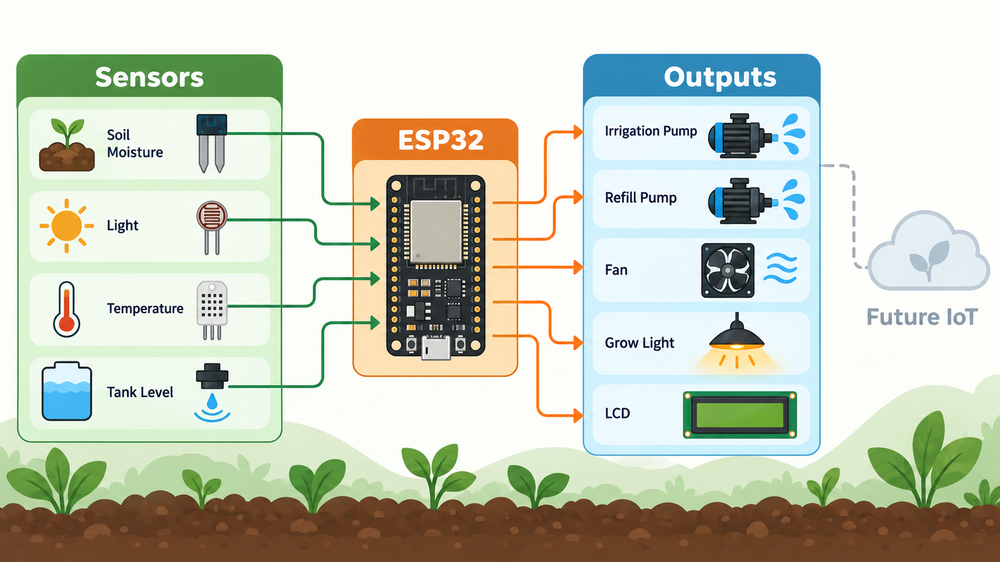

## Important safety rules

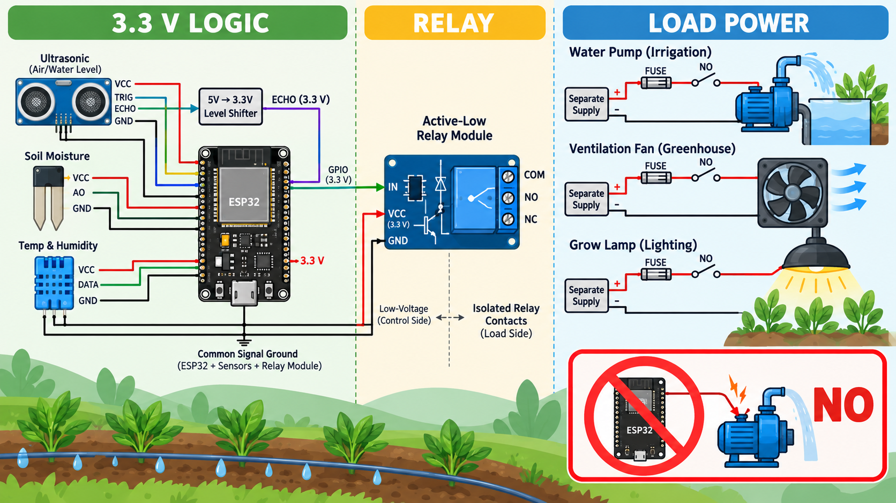

- Build and test the low-voltage controller before connecting pumps, lamps, fans, or mains wiring.
- Never power a pump, fan, or lamp from an ESP32 GPIO, 3.3 V pin, USB port, or sensor shield rail. Use a separate power supply sized for each load.
- Use the relay's Normally Open terminal so each load remains off when the relay is not energized.
- The code expects an active-low relay board: `HIGH` is off and `LOW` is on. Confirm this behavior with the relay LEDs before connecting any load.
- Connect all low-voltage grounds that must share a signal reference. Follow the relay-board instructions if its opto-isolation is being used as true isolation.
- Keep every ESP32 GPIO at 3.3 V logic. Espressif specifies 3.6 V as the maximum allowed input voltage. Do not feed a 5 V potentiometer, soil-sensor output, LDR divider output, I2C pull-up, or HC-SR04 Echo signal directly into the ESP32. See the repository-hosted [ESP32 datasheet](output/pdf/esp32-datasheet.pdf).
- Reduce the HC-SR04 Echo signal to 3.3 V with a suitable resistor divider or logic-level shifter. A common starting divider is 1 kOhm from Echo to GPIO19 and 2 kOhm from GPIO19 to ground.
- A 5 V I2C backpack may pull SDA and SCL up to 5 V. Use a bidirectional I2C level shifter, or power the backpack at 3.3 V only if that particular LCD works reliably at 3.3 V.
- Use a fuse on each load supply. Add the protection recommended for the load and driver, especially for DC motors and pumps.
- Have a qualified electrician handle mains-voltage loads. Keep mains wiring out of the low-voltage breadboard and controller enclosure.
- Do not leave this prototype operating unattended. The supplied code has no pump runtime limit, dry-run protection, overflow switch, sensor-failure shutdown, relay feedback, or emergency stop.

## Parts

The complete smart-farming sketch uses the following parts:

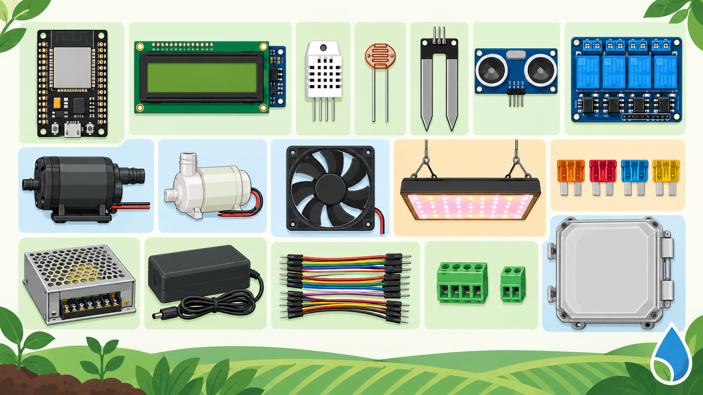

- ESP32 development board based on the original ESP32, such as the ESP-32U board shown in the references
- ESP32 expansion shield or a suitable prototyping board
- USB data cable and a stable ESP32 power source
- 16x2 HD44780-compatible LCD with an I2C backpack at address `0x27`
- DHT22 temperature and humidity sensor
- Analog LDR module or a correctly built 3.3 V LDR voltage divider
- Analog resistive soil-moisture sensor
- HC-SR04 ultrasonic sensor and a 5 V-to-3.3 V Echo level divider
- Four-channel, 3.3 V-input-compatible, active-low relay module
- Irrigation pump or solenoid valve, tank-refill pump, fan, and grow light
- Separate load power supplies, fuses, terminal blocks, and an enclosure
- Jumper wires and suitable resistors

For an irrigation-only bench test, you can begin with the ESP32, soil sensor, one active-low relay channel, LCD, and a low-voltage pump with its own supply.

## Pin assignment from the supplied code


| Function                  | ESP32 pin | Direction  | Notes                                                                 |
| ------------------------- | --------: | ---------- | --------------------------------------------------------------------- |
| DHT22 data                |     GPIO4 | Input      | Temperature is used; humidity is read only in the mini weather sketch |
| LDR analog output         |    GPIO34 | Input only | The full sketch assumes raw values from 2500 to 4095                  |
| Soil sensor analog output |    GPIO35 | Input only | The full sketch assumes 4095 is dry and 2000 is wet                   |
| HC-SR04 Trigger           |    GPIO18 | Output     | 10 microsecond trigger pulse                                          |
| HC-SR04 Echo              |    GPIO19 | Input      | Reduce the 5 V Echo signal to 3.3 V                                   |
| LCD SDA                   |    GPIO21 | I2C data   | Default ESP32 I2C pin                                                 |
| LCD SCL                   |    GPIO22 | I2C clock  | Default ESP32 I2C pin                                                 |
| Grow-light relay          |    GPIO25 | Output     | Active low                                                            |
| Cooling-fan relay         |    GPIO26 | Output     | Active low                                                            |
| Irrigation or spray relay |    GPIO27 | Output     | Active low                                                            |
| Tank-refill relay         |    GPIO14 | Output     | Active low                                                            |

GPIO34 and GPIO35 are appropriate analog inputs, but they are input-only and have no internal pull-up or pull-down resistors. Espressif documents this restriction in its [ESP32 hardware design guidelines](https://docs.espressif.com/projects/esp-hardware-design-guidelines/en/latest/esp32/esp-hardware-design-guidelines-en-master-esp32.pdf).

## How the supplied controller behaves

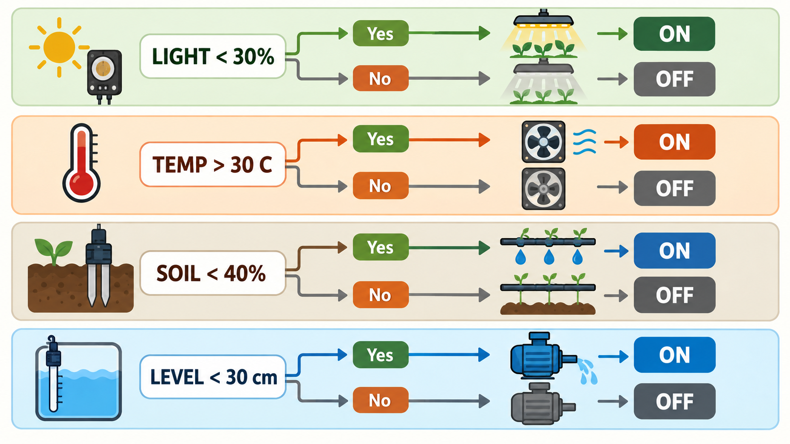

| Measurement      | Fixed assumption or threshold | Controller response                    |
| ---------------- | ----------------------------- | -------------------------------------- |
| Light            | Below 30 percent              | Turns the grow-light relay on          |
| Temperature      | Above 30.0 C                  | Turns the fan relay on                 |
| Soil moisture    | Below 40 percent              | Turns the irrigation or spray relay on |
| Tank water level | Below 30 cm in a 45 cm tank   | Turns the refill-pump relay on         |

The ESP32 ADC returns a raw value with a default 12-bit range of 0 to 4095. The supplied sketch maps those raw values into percentages. The raw reading is not calibrated voltage; see the [Arduino-ESP32 ADC reference](https://docs.espressif.com/projects/arduino-esp32/en/latest/api/adc.html).

## Prepare Arduino IDE

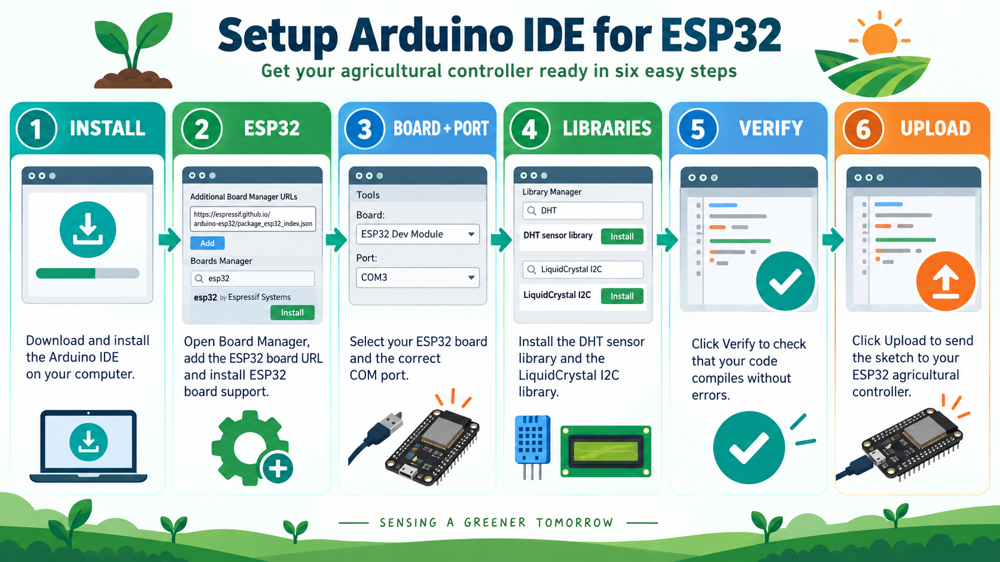

1. Install Arduino IDE.
2. Install ESP32 board support through Boards Manager, following Espressif's [Arduino-ESP32 installation guide](https://docs.espressif.com/projects/arduino-esp32/en/latest/installing.html).
3. Select the board definition that matches your ESP32. If the exact board is unavailable, `ESP32 Dev Module` is commonly suitable for a generic original-ESP32 development board; confirm this with the board supplier.
4. Select the COM port that appears when the board is connected.
5. Install `DHT sensor library` by Adafruit from Library Manager. Also install its `Adafruit Unified Sensor` dependency. The library's [repository](https://github.com/adafruit/DHT-sensor-library) documents both requirements.
6. Install a `LiquidCrystal_I2C` library that supports the exact API used by the reference code: `LiquidCrystal_I2C(0x27, 16, 2)` followed by `lcd.begin()` with no arguments. Libraries with the same header name are not interchangeable. The [compatible API demonstrated here](https://github.com/lucasmaziero/LiquidCrystal_I2C) uses the same constructor and zero-argument `begin()` call.

If compilation reports that `lcd.begin()` needs arguments, the wrong `LiquidCrystal_I2C` implementation is installed. Replace the library instead of editing the supplied sketch.

## Build the low-voltage circuit

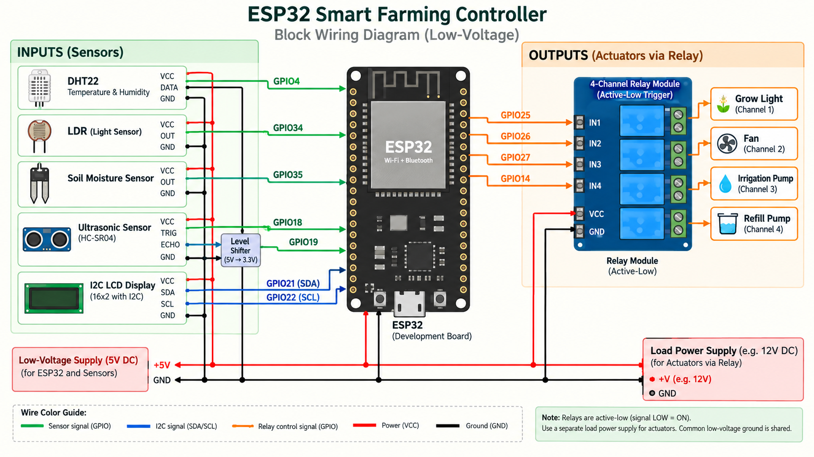

### Connect the LCD

Connect LCD SDA to GPIO21 and SCL to GPIO22. Connect ground as required. Use safe 3.3 V I2C levels as described above. The sketch assumes I2C address `0x27`; a display with a different address will not work without a code change.

### Connect the environmental sensors

1. Connect DHT22 data to GPIO4. Power the module at a safe voltage supported by the module. A bare DHT22 normally needs a pull-up resistor on its data line; many breakout modules include one.
2. Connect the LDR module's analog output to GPIO34. Ensure the analog output never exceeds 3.3 V.
3. Connect the soil sensor's analog output to GPIO35. Power it so its analog output stays within the ESP32 input range.
4. Mount the HC-SR04 above the tank, facing straight down. Connect Trigger to GPIO18. Connect Echo to GPIO19 through a 5 V-to-3.3 V divider or level shifter. Measure tank height from the sensor face to the usable bottom reference.

The code assumes the ultrasonic sensor is installed on a 45 cm tank. It calculates water depth as `45 - measured distance` in the complete smart-farming sketch.

### Connect the relay inputs

Connect the relay input channels to GPIO25, GPIO26, GPIO27, and GPIO14 according to the table above. Power the relay module from an adequate supply and establish the required signal ground. Leave the relay screw terminals disconnected while testing the controller logic.

On reset, the sketch sets all four relay outputs to `HIGH`, which is the off state for the expected active-low module. Confirm that all relay LEDs are off after startup.

### Connect the loads after logic testing

For each normally-off low-voltage load:

1. Disconnect all power.
2. Connect the load supply positive to relay `COM`.
3. Connect relay `NO` to the load positive.
4. Connect the load negative to the load supply negative.
5. Add the required fuse and motor or solenoid protection.
6. Check polarity and insulation before restoring power.

The irrigation device belongs on the GPIO27 relay channel. The tank-refill pump belongs on the GPIO14 relay channel. These are separate functions and may use separate pumps.

## Upload the supplied sketches

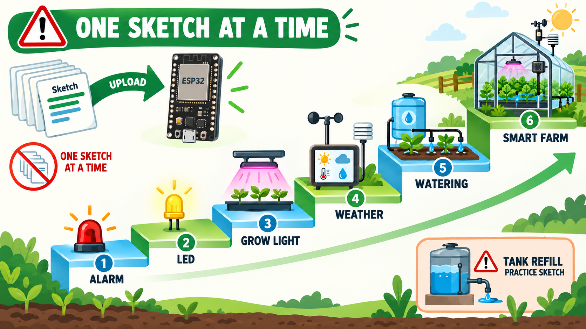

The complete standalone sketches are included below. Each sketch has its own `setup()` and `loop()`, so do not combine multiple listings in one Arduino sketch.

For every stage:

1. Choose one complete code listing from this tutorial.
2. Create a new Arduino sketch and paste the listing into it.
3. Save the sketch with a descriptive name.
4. Click Verify.
5. Connect the ESP32, select its board and port, and click Upload.
6. If upload waits at `Connecting`, hold the board's Boot button until writing begins, then release it.
7. Test the stage before continuing.

Use this progression:

1. `Workshop - Smart Alarm` verifies a digital input and output on GPIO32 and GPIO33. It is optional for the irrigation build.
2. `Workshop - LED Dimming with Potentiometer` verifies an analog input and PWM output. It is optional but useful for learning the ADC behavior.
3. `Workshop - Smart Grow Light system` tests the LDR, LCD, and GPIO25 relay.
4. `Workshop - mini weather station` tests the DHT22, LCD, and GPIO26 relay.
5. `Workshop - automated watering system` is the first irrigation test. It turns the GPIO27 relay on when the calculated soil moisture is below 40 percent.
6. Skip deployment of the standalone `Workshop - automated tank refilling` sketch. Its `waterLevel` variable remains zero, so an active-low refill relay will remain on. This defect is present in the reference and has not been changed.
7. Upload `Workshop - Smart Farming System` for the integrated test. Its tank calculation uses `tankHeight - distance`, so it does not contain the standalone workshop's zero-level defect.

## Complete source sketches

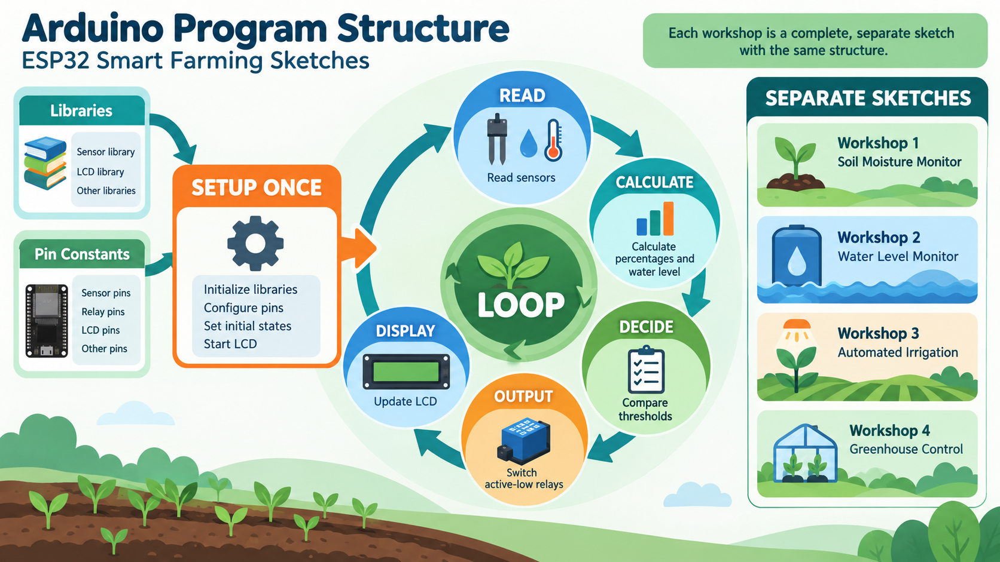

The listings in this section reproduce the complete source sketches from the reference document. No logic has been corrected or extended. Compile and upload only one listing at a time.

### Smart Alarm Button and Buzzer

```cpp
const int buttonPin = 32;
const int buzzerPin = 33;

void setup() {
  pinMode(buttonPin, INPUT);
  pinMode(buzzerPin, OUTPUT);
  digitalWrite(buzzerPin, LOW);
}

void loop() {
  if (digitalRead(buttonPin) == HIGH) {
    digitalWrite(buzzerPin, HIGH);
  }
  else {
    digitalWrite(buzzerPin, LOW);
  }
}
```

### LED Dimming with Potentiometer

```cpp
const int potPin = 34;
const int ledPin = 25;

void setup() {
  Serial.begin(9600);
  pinMode(potPin, INPUT);
  pinMode(ledPin, OUTPUT);
}

void loop() {

  int potValue = analogRead(potPin);
  int brightness = map(potValue, 0, 4095, 0, 255);
  analogWrite(ledPin, brightness);

  Serial.println(potValue);
  delay(50);
}
```

### Smart Grow Light System

```cpp
#include <Wire.h>
#include <LiquidCrystal_I2C.h>

LiquidCrystal_I2C lcd(0x27, 16, 2);
const int ldrPin = 34;
const int relayLamp = 25;
const int targetLight = 30;

void setup() {
  lcd.begin();
  lcd.backlight();
  pinMode(relayLamp, OUTPUT);
  digitalWrite(relayLamp, HIGH);
  Serial.begin(115200);
}

void loop() {
  int rawLight = analogRead(ldrPin);
  int lightPercent = map(rawLight, 2500, 4095, 0, 100);
  lightPercent = constrain(lightPercent, 0, 100);

  String lampStatus = "OFF";
  if (lightPercent < targetLight) {
    digitalWrite(relayLamp, LOW);
    lampStatus = "ON ";
  } else {
    digitalWrite(relayLamp, HIGH);
    lampStatus = "OFF";
  }

  Serial.println(rawLight);

  lcd.setCursor(0, 0);
  lcd.print("Light Sensor    ");
  lcd.setCursor(0, 1);
  lcd.print("L:");
  lcd.print(lightPercent);
  lcd.print("% Lamp:");
  lcd.print(lampStatus);
  lcd.print("   ");

  delay(1000);
}
```

### Mini Weather Station

```cpp
#include <Wire.h>
#include <LiquidCrystal_I2C.h>
#include "DHT.h"

LiquidCrystal_I2C lcd(0x27, 16, 2);
DHT dht(4, DHT22);
const int relayFan = 26;
const float targetTemp = 30.0;

void setup() {
  dht.begin();
  lcd.begin(); lcd.backlight();
  pinMode(relayFan, OUTPUT);
  digitalWrite(relayFan, HIGH);
}

void loop() {
  float t = dht.readTemperature();
  float h = dht.readHumidity();

  String fanStatus = "OFF";
  if (t > targetTemp) {
    digitalWrite(relayFan, LOW); fanStatus = "ON ";
  } else {
    digitalWrite(relayFan, HIGH);
  }

  lcd.setCursor(0, 0); lcd.print("Temp: "); lcd.print(t, 1); lcd.print(" C  ");
  lcd.setCursor(0, 1); lcd.print("Humi:"); lcd.print(h, 0); lcd.print("% Fan:"); lcd.print(fanStatus);

  delay(2000);
}
```

### Automated Watering System

```cpp
#include <Wire.h>
#include <LiquidCrystal_I2C.h>

LiquidCrystal_I2C lcd(0x27, 16, 2);
const int soilPin = 35;
const int relaySpray = 27;
const int targetSoil = 40;

void setup() {
  Serial.begin(115200);
  lcd.begin(); lcd.backlight();
  pinMode(relaySpray, OUTPUT);
  digitalWrite(relaySpray, HIGH);
}

void loop() {
  int rawSoil = analogRead(soilPin);
  int soilPercent = map(rawSoil, 4095, 2000, 0, 100);
  soilPercent = constrain(soilPercent, 0, 100);

  String sprayStatus = "OFF";
  if (soilPercent < targetSoil) {
    digitalWrite(relaySpray, LOW); sprayStatus = "ON ";
  } else {
    digitalWrite(relaySpray, HIGH);
  }

  Serial.println(rawSoil);
  lcd.setCursor(0, 0); lcd.print(" Soil Moisture");
  lcd.setCursor(0, 1); lcd.print("S:"); lcd.print(soilPercent); lcd.print("% Spray:"); lcd.print(sprayStatus);
  lcd.print("   ");

  delay(1000);
}
```

### Automated Tank Refilling Workshop

Do not connect a real refill pump while running this standalone workshop sketch. As supplied, it leaves `waterLevel` at zero, so an active-low refill relay stays on. The listing is included unchanged for completeness.

```cpp
#include <Wire.h>
#include <LiquidCrystal_I2C.h>

LiquidCrystal_I2C lcd(0x27, 16, 2);
const int trigPin = 18;
const int echoPin = 19;
const int relayPump = 14;

const int tankHeight = 45;
const int targetWaterLevel = 30;

void setup() {
  lcd.begin();
  lcd.backlight();

  pinMode(trigPin, OUTPUT);
  pinMode(echoPin, INPUT);
  pinMode(relayPump, OUTPUT);
  digitalWrite(relayPump, HIGH);
}

void loop() {

  digitalWrite(trigPin, LOW); delayMicroseconds(2);
  digitalWrite(trigPin, HIGH); delayMicroseconds(10);
  digitalWrite(trigPin, LOW);

  long duration = pulseIn(echoPin, HIGH);
  int distance = duration * 0.034 / 2;

  int waterLevel = 0;

  if (waterLevel < 0) {
    waterLevel = 0;
  }

  String pumpStatus = "OFF";
  if (waterLevel < targetWaterLevel) {
    digitalWrite(relayPump, LOW);
    pumpStatus = "ON ";
  } else {
    digitalWrite(relayPump, HIGH);
    pumpStatus = "OFF";
  }

  lcd.setCursor(0, 0);
  lcd.print("Dist Sensor:");
  lcd.print(distance);
  lcd.print("cm ");

  lcd.setCursor(0, 1);
  lcd.print("W:");
  lcd.print(waterLevel);
  lcd.print("cm Pump:");
  lcd.print(pumpStatus);
  lcd.print(" ");

  delay(500);
}
```

### Complete Smart Farming System

```cpp
#include <Wire.h>
#include <LiquidCrystal_I2C.h>
#include "DHT.h"

DHT dht(4, DHT22);

const int ldrPin = 34;
const int soilPin = 35;
const int trigPin = 18;
const int echoPin = 19;

const int relayLamp = 25;
const int relayFan = 26;
const int relaySpray = 27;
const int relayPump = 14;

const int targetLight = 30;
const float targetTemp = 30.0;
const int targetSoil = 40;
const int tankHeight = 45;
const int targetWaterLevel = 30;

LiquidCrystal_I2C lcd(0x27, 16, 2);

void setup() {
  dht.begin();
  lcd.begin();
  lcd.backlight();

  pinMode(relayLamp, OUTPUT);
  pinMode(relayFan, OUTPUT);
  pinMode(relaySpray, OUTPUT);
  pinMode(relayPump, OUTPUT);

  pinMode(trigPin, OUTPUT);
  pinMode(echoPin, INPUT);

  digitalWrite(relayLamp, HIGH);
  digitalWrite(relayFan, HIGH);
  digitalWrite(relaySpray, HIGH);
  digitalWrite(relayPump, HIGH);

  lcd.setCursor(0, 0);
  lcd.print("Smart Farm v5.0 ");
  delay(2000);
}

void loop() {
  int lightPercent = map(analogRead(ldrPin), 2500, 4095, 0, 100);
  lightPercent = constrain(lightPercent, 0, 100);

  float t = dht.readTemperature();

  int soilPercent = map(analogRead(soilPin), 4095, 2000, 0, 100);
  soilPercent = constrain(soilPercent, 0, 100);

  digitalWrite(trigPin, LOW);
  delayMicroseconds(2);
  digitalWrite(trigPin, HIGH);
  delayMicroseconds(10);
  digitalWrite(trigPin, LOW);

  long duration = pulseIn(echoPin, HIGH);
  int distance = duration * 0.034 / 2;

  int waterLevel = tankHeight - distance;
  if (waterLevel < 0) {
    waterLevel = 0;
  }

  String lampSt = "OFF";
  if (lightPercent < targetLight) {
    digitalWrite(relayLamp, LOW);
    lampSt = "ON ";
  } else {
    digitalWrite(relayLamp, HIGH);
  }

  String fanSt = "OFF";
  if (t > targetTemp) {
    digitalWrite(relayFan, LOW);
    fanSt = "ON ";
  } else {
    digitalWrite(relayFan, HIGH);
  }

  String spraySt = "OFF";
  if (soilPercent < targetSoil) {
    digitalWrite(relaySpray, LOW);
    spraySt = "ON ";
  } else {
    digitalWrite(relaySpray, HIGH);
  }

  String pumpSt = "OFF";
  if (waterLevel < targetWaterLevel) {
    digitalWrite(relayPump, LOW);
    pumpSt = "ON ";
  } else {
    digitalWrite(relayPump, HIGH);
  }

  lcd.setCursor(0, 0);
  lcd.print("L:"); lcd.print(lightPercent); lcd.print("% Lamp:"); lcd.print(lampSt); lcd.print("  ");

  lcd.setCursor(0, 1);
  lcd.print("T:"); lcd.print(t, 1); lcd.print("C Fan :"); lcd.print(fanSt); lcd.print("  ");

  delay(2000);

  lcd.setCursor(0, 0);
  lcd.print("S:"); lcd.print(soilPercent); lcd.print("% Spry:"); lcd.print(spraySt); lcd.print("  ");

  lcd.setCursor(0, 1);
  lcd.print("W:"); lcd.print(waterLevel); lcd.print("cm Pmp :"); lcd.print(pumpSt); lcd.print("  ");

  delay(2000);
}
```

## Test the automated watering stage

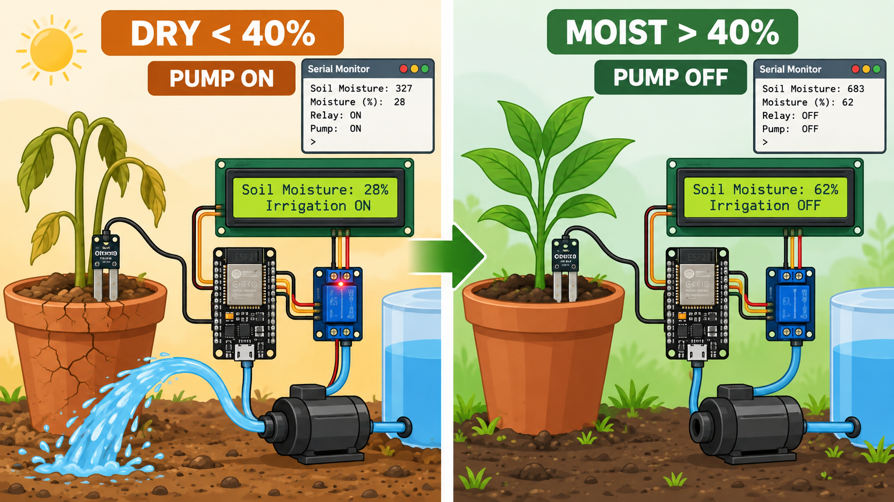

Keep the pump disconnected from the relay contacts during the first test.

1. Upload the standalone automated watering sketch exactly as supplied.
2. Open Serial Monitor at 115200 baud.
3. Hold the soil probe in air. The raw value should move toward the dry end, and the LCD should show a low moisture percentage. The GPIO27 relay LED should turn on.
4. Place only the sensing area into moist soil or a controlled test sample. Do not immerse the electronics. The displayed percentage should rise, and the relay should turn off above 40 percent.
5. Repeat the transition several times. If the displayed value is permanently 0 or 100 percent, the actual sensor range does not match the code's fixed 4095-to-2000 mapping.
6. Only after the relay logic is correct, disconnect power and attach the irrigation pump or valve to `COM` and `NO`.
7. Restore power and supervise a short watering test. Confirm that water reaches the intended zone, no fitting leaks, and the pump stops when the measured moisture rises above the threshold.

Resistive soil probes corrode when continuously energized. Treat the supplied sensor arrangement as a supervised workshop prototype, not a maintenance-free field installation.

## Test the complete system

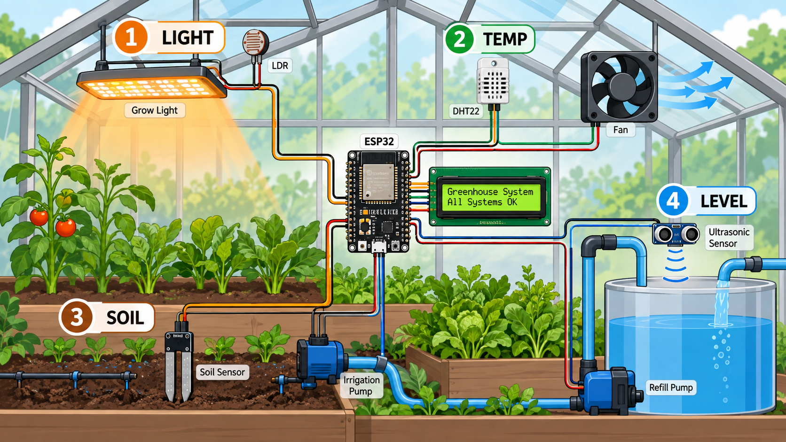

Upload the final `Workshop - Smart Farming System` sketch exactly as supplied, then test one input at a time:

1. Cover and uncover the LDR. Below 30 percent light, the GPIO25 relay should turn on.
2. Warm the DHT22 gently. Above 30.0 C, the GPIO26 relay should turn on.
3. Move the soil probe between dry and moist test samples. Below 40 percent, the GPIO27 relay should turn on.
4. Change the distance between the HC-SR04 and a flat target. The code treats this as the air gap above the water. With a 45 cm tank, a 20 cm air gap produces a 25 cm water level. Below 30 cm, the GPIO14 relay should turn on.
5. Watch both LCD screens. The display alternates every two seconds between light and temperature states, then soil and water-level states.
6. Reconnect and test only one real load at a time. Finish with all loads connected and observe at least one complete on-off cycle for every channel.

The reference slide's example states that a 45 cm tank with a 20 cm air gap gives a 15 cm water level. That arithmetic is incorrect. The final code's calculation gives 25 cm. This tutorial records the discrepancy without editing either reference file.

## Acceptance checklist

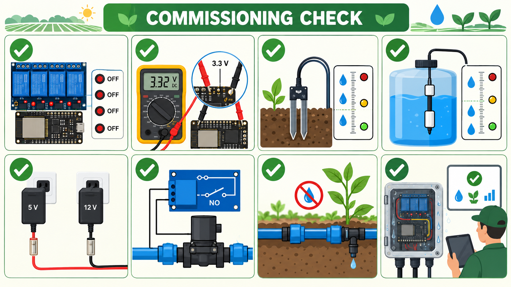

- The controller starts with all four active-low relays off.
- No ESP32 input or I2C line can rise above 3.3 V during measurement.
- The soil sensor changes across both sides of the 40 percent threshold in the intended soil.
- The refill channel changes across both sides of the 30 cm water-level threshold.
- The irrigation pump uses `NO`, stops when its relay is off, and cannot siphon after stopping.
- The refill pump cannot overflow the tank during the supervised test.
- Each load has an adequate power supply and fuse.
- The controller and all connectors are protected from water, condensation, insects, and strain on cables.
- The external antenna is securely connected before relying on future Wi-Fi operation.
- The system remains supervised because the supplied software lacks production safety interlocks.

## Troubleshooting

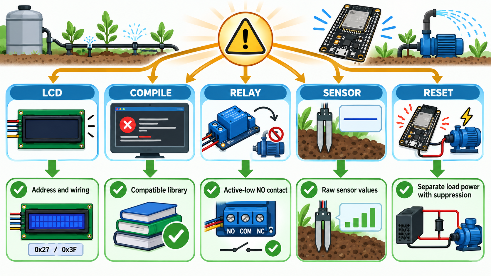

| Symptom                                              | Check                                                                                                                      |
| ---------------------------------------------------- | -------------------------------------------------------------------------------------------------------------------------- |
| `LiquidCrystal_I2C.h` not found                      | Install a compatible LiquidCrystal I2C library                                                                             |
| `lcd.begin()` compile error                          | Remove the incompatible library and install one with a zero-argument `begin()` API                                         |
| `DHT.h` not found                                    | Install Adafruit's DHT sensor library and its Unified Sensor dependency                                                    |
| LCD backlight is on but text is absent               | Check address `0x27`, contrast, SDA/SCL wiring, and logic-level safety                                                     |
| Relay turns on when it should be off                 | Confirm that the board is active low and the load is on `NO`, not `NC`                                                     |
| Soil percentage is fixed at 0 or 100                 | Measure the raw serial values; the sensor does not match the fixed 4095-to-2000 mapping or its output voltage is incorrect |
| Refill pump stays on with the standalone tank sketch | Do not deploy that sketch; its water level is never calculated                                                             |
| Full-system tank level is wrong                      | Check the 45 cm tank-height assumption, sensor mounting, reflections, and Echo level shifting                              |
| Upload fails at `Connecting`                         | Check the USB data cable and port; hold Boot while upload begins                                                           |
| ESP32 resets when a relay or pump starts             | Use separate adequate load power, improve grounding and suppression, and do not power loads through the ESP32              |

## Limits of the unchanged code

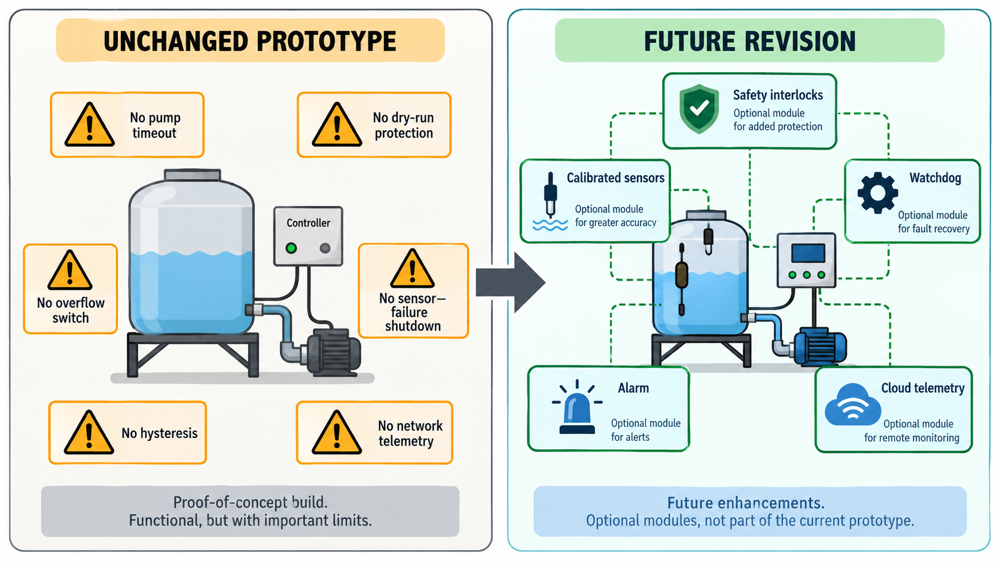

The supplied code is suitable for a supervised workshop demonstration. Before field deployment, a later software revision should add sensor-failure handling, calibrated endpoints, hysteresis, maximum pump runtimes, minimum tank interlocks, ultrasonic timeouts, persistent alarms, watchdog behavior, and network telemetry. Those improvements are not included here because they would change the code supplied in `ref`.
